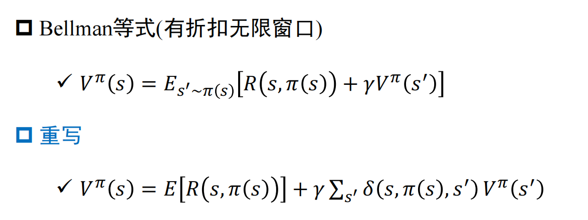

## Ch2. 搜索

OPEN, CLOSED列表：OPEN记录待搜索结点；CLOSED记录已搜索结点

#### 最佳优先搜索

定义一个启发式算法：按照一定启发式函数 对每个OPEN结点排序；按顺序在OPEN中搜索

#### A* 算法

每个节点的优先级：$f(n)=g(n)+h(n)$

- $f(n)$，n的综合优先级；$g(n)$，n距离起点的代价（bfs）；$h(n)$，n距离终点的预计代价，**启发函数**！
- 若$h(n)$始终=0，则退化为了Dijkstra算法；
- 若$h(n)$始终<=节点n到终点的代价，则A*算法保证能找到最优路径！

## Ch4. 知识表示

常见知识表示方法：

- 一阶谓词表示
- 产生式表示
- 语义网络表示
- 框架表示
- 脚本表示

#### 一阶谓词表示

#### 产生式表示

例子：若ppp 则qqq

​	 P$\to$Q 或 IF P THEN Q     （产生式）

​	 产生式可以是不精确的，有可信度；**而一阶谓词的蕴含式是非真即假的**

##### 基本流程&结构

**专家系统**：不断从规则库中选择可应用的规则，并将得到的新事实加入到数据库（有事实驱动 和 目标驱动 两种）

- 本质是 **深度优先搜索**

#### 语义网络表示

结构/形式：有向图，定点表示概念，边 表示概念间语义关系。如图：

- 边 有多种类别，可表示不同种类的关系，如：类属关系（ISA，member-of，kind-of），包含/聚类关系（part-of），属性关系（have，can），时间、位置、相似、推理关系等等，以及多元关系（一般是一元，如A$\to$B）

推理：首先将待求解问题构造为**网络片段**（+查询点），然后根据原语义网络信息进行匹配得到解。如：

问：陈家骏教授工作地点？

知识图谱（语义关系简化了的语义网络？）被用于了搜索引擎、智能问答软件、社交网络（Facebook）中 存储和表示知识

**本质与谓词演算等价**

#### 框架表示

表示形式 和 层级结构：框架名 、 槽名（描述某一方面属性） 、 侧面（描述属性的某一方面） 、 值

向数据库的查询？

## Ch5. 不确定性推理

**例子**：已知：“若电池或电缆有问题，则发动机不旋转且不亮”  是一条可靠知识

则：“若发动机不转且不量，则电池或电缆有问题”  是一条不可靠知识！

##### 反绎推理（溯因推理）

P$\to$Q 和 Q：   有可能推出P（不确定）

**从不确定性初始事实，运用不确定性知识，获得不确定但合理的结论**

#### 非单调推理

基于假设的推理，存在多条假设，并可以根据新证据排除/修正部分假设

1. unless：p(x) unless q(x) $\to$ r(x)：p(x)$\to$q(x)为真，除非q(x)成立

   ​	若q(x)不知道是否为真，则可以先使用p(x)$\to$q(x)

2. is constent with：（**M** B(x) 意思为：没有证据表明 B(x)不成立/与现有证据矛盾）

#### 真值维护系统TMS

TMS实现机制：

- 关联机制：将每条结论和理由 联系在一起；
- 定位机制：给定矛盾和理由，定位错误的假设
- 回收机制：收回错误假设
- 追溯机制：收回错误的假设的结论

##### 理由网络：

#### 封闭世界假设

只有求解问题需要的谓词，并且谓词的（定义域？）都是确定且封闭的：则若不含有p(X)为真，则not(p(X))为真

#### 确信度理论

MB(H|E)：给定证据E时，假设H的可信度量，取值范围[0,1]     （>0说明E的出现提高了H出现的概率；否则=0）

MD(H|E)：给定证据E时，假设H的不可信度量，取值范围[0,1]

产生式规则一般形式：IF E THEN H $\text{\textcolor{red}{(CF(H|E)}}$)

- CF(H|E)为该条**知识**的确信度，CF(H|E) = MB(H|E) - MD(H|E)

- 同一证据不可能同时增加和降低H的可信度；MB和MD一定是互斥的（至多一个非0）

**证据的不确定性**：（也由确信度表示）

- CF(E) $\in [-1,1]$ ：-1，证据E肯定为假； 1，E肯定为真； 0，对E一无所知
  - 故 CF($\neg$E) = -CF(E)
- 合取与析取
  - E=E1 and E2 and E3 and ...，则 CF(E) = min\{CF(E1), CF(E2), CF(E3), ...\}
  - E=E1 or E2 or E3 or ...，则 CF(E) = max\{CF(E1), CF(E2), CF(E3), ...\}
- 注意与CF(H|E)的区别！(知识的不确定性)

**不确定性的更新公式**： CF(H) = CF(H|E) $\times$ max\{0, CF(E)\}

**结论不确定性的合成**：（多条知识算出的同一结论的确信度CF1(H)和CF2(H)，且***知识的前提互相独立***，则可以合成结论的综合确信度）

- 

#### 信任函数

**下限函数Bel**：Bel(A) 表示对A的总信任度（即A为真的确信度）

**上限函数Pl**：Pl(A)=1-Bel($\neg$A) 表示A为非假的信任度

对A信任程度的上下限：A[Bel(A), Pl(A)]；  Pl(A)-Bel(A)对应“不知道” 的情况

**证据合并规则**：

## Ch6. 贝叶斯网络

**概念**：

- 先验概率 vs 后验概率：**先验**，非条件概率，P(A)；  **后验**，条件概率，P(A|E)
- 演绎推理 vs 归纳推理：演绎，不要求前件为真；   归纳，前件必须为真，但结论未必（从特殊到一般）
- 贝叶斯定理：（全概率公式）$P(Hi|E)=\frac{P(E|Hi)P(Hi)}{\sum_{k}P(E|Hk)P(Hk)}$

- 链式规则：$P(H|E1\cap E2\cap E3\cap ...\cap En)=...$

#### 贝叶斯信念网络

**顺序连接**：

**分支连接**：

**汇合连接**：

#### d-可分

节点A到B的路径中，若存在：

1. 顺序 / 分支连接 结构的中间节点已知
2. 汇合连接 结构的中间节点及其所有子节点未知

**则路径被阻断，A和B相互独立；否则A和B不相互独立**

- **变量的顺序是会影响建图结构的！**

## Ch7. 马尔可夫网络

有限状态系统\{$s_1,s_2,...,s_n$\}，离散时间点$t_i$下 对象所处状态记为$X_i$，满足：对象在t处所处状态的概率取决于时间1，2，...，t-1时的状态

则**一阶马尔科夫链**满足：$P(X_t=s_k|X_{t-1},...,X_2,X_1)=P(X_t=s_k|X_{t-1})$

#### 马尔可夫逻辑网 （MLN）

##### 变量消除

## Ch8. 符号学习

#### 概念学习

就是机器学习里的 二分类问题~

#### 决策树

**ID3算法**：ID3(Examples，Attributes)

1. 创建Root结点
2. 基本情况：Examples中目标属性全为“+”/“-”，直接返回对应label的单结点树Root；若Attributes为空，则label设为Examples中最普遍的目标属性值
3. 否则，找到Attributes中分类能力最好的属性A 作为Root的决策属性，并为A的每种可能取值 建立一个子树/叶子结点

**选择最佳属性**：

- 熵：对于样本集合S，Entropy(S) = $\sum_{i}-p_i\log_2p_i$   ，熵越小越好（i为**目标属性**的所有可能取值，反映了集合S的混乱（不纯）程度！）

- 信息增益：

##### C4.5算法

先从候选划分属性中找出 信息增益 高于平均水平的属性，再从中选择 信息增益率 最高的

- 信息增益率：信息增益 / 该属性的熵 = Gain(S, A) / IV(A)
  - IV(A)= $-\sum_{v\in \text{Values}(A)}\frac{|S_v|}{|S|}\log\frac{|S_v|}{|S|}$

## Ch9. 神经网络

#### 感知机

#### 反向传播（BP）算法

## Ch.10 遗传算法

1. 根据所有属性即可能的取值，确定“染色体”的表示（即一个0/1/#串，每位分别代表某个属性值的某个取值，#表示 no care）
2. 确定适应度函数！即描述某一“染色体”（即 某一特定解）的好坏程度，适应度大小会影响一条“染色体”被选中交换+保留的概率
3. 一开始随机选择？若干条“染色体”，然后通过适应度函数 以及选择方法，选出其中的若干条 （选择方法 影响到exploration & exploitation trade）
4. 两两进行交换，交换策略有多种；以及较低概率突变
5. 加入这些新的“染色体”，并替换掉一些较差“染色体”

## Ch.11 强化学习

##### Bellman等式 （策略评估）

- 其中 $\delta(s,\pi(s),s')$表示从状态s 且采用了action $\pi(s)$，会转移到状态s‘ 的概率

##### 时间差分（TD）算法

（用来学习/更新值函数 以及 策略）

- 其中$r_t$为一次经验，$R^{(0)}=r_t+\gamma V(s_{t+1})$
- N步TD：即$R^{N}=r_t+\gamma r_{t+1}+\gamma^2r_{t+2}+...+\gamma^nV(s_{t+n})$替换$R^{(0)}$

### 划重点

- 搜索（对于给定的搜索问题了解深度、广度以及启发式搜索的求解方案，启发式搜索中了解启发式函数的定义以及会展开搜索树）；
- 推理和知识表示（掌握命题演算、谓词演算以及如何进行推理，可参考课后习题）
- 不确定性推理（重点掌握贝叶斯网络以及马尔科夫网络，知道网络的构建以及联合概率分布如何约简以及怎么进行因果推理和诊断推理）
- 符号学习（掌握决策树构建，给出数据案例可构建ID3或C4.5的树）
- 神经网络（掌握感知机学习算法、BP算法，给出数据案例可通过算法得到相应的网络结构）
- 遗传算法（掌握对给定问题可通过遗传算法解决，怎么编码，怎么进行交叉、变异等操作，最终得到解）
- 强化学习（掌握Bellman等式以及状态值函数的计算，TD算法）
- 博弈（掌握博弈矩阵定义方法，掌握帕利托优解和纳什均衡解定义，可找出不同问题的解，可参考课上例子）
