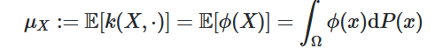

## Ch1. Introduction

### data mining

从大数据库中挖掘有用的信息，然后用它来做重要决策

初始数据可能无法直接使用，需要先：collect，clean，transform into a standardized format

data mining的四个super-problems： association pattern mining，clustering，classification，outlier detection

- classification：分类任务
  - 有标签（class label）
  - classification 和 regression（回归：标签是一个值） 都是supervised learning task
    - supervision：指特殊列（data matrix中，即标签）被用来direct the data mining process
  - classification methods：
    - 支持向量机（support vector machines）
    - K-nearest neighbor classification（KNN）K-近邻算法：
      - 就是先（随机？）取若干个点，将离他们最近的k个样本点分别划入对应的区域
    - 决策树（decision trees）
    - rule-based classifier：不知道
  - 可以视为有监督版本的clustering！
- clustering
  - 将数据集分为多个子集，每个子集在属性值相关，各个子集比较相似
  - $\textcolor{red}{当一行的某一属性与其他行的该属性显著不同时}$，$\textcolor{red}{它被视为一个anomaly，问题也变为了outlier\; analysis}$。
- anomaly detection（outlier detection / novelty detection）
- association pattern mining
  - 最初版本：data matrix的值只取0或1（可以推广至数值/枚举型属性值）
  - frequent pattern mining problem：

## Ch2. Data Preparation

- data preparation phase：
  1. featrue extraction and protability(数据类型转换)
  2. data cleaning(清除错误数据，inconsistent不一致的数据（即在不同地方不完全匹配），还有缺失的数据可能被重新估计出来？)
  3. data reduction, selection, transformation
- multidimensional data vs complex data
  - ID：one distribution， each point is independent on others？（mul）each point is generated from the same （unknown） distribution！
  - 
- 四种基本的数据模式
  - nominal（名义的） data：如城市、物种
  - ordinal（顺序的） data：如速度快慢（快、中、慢）（非连续的，有限的？）
  - interval data：有大小关系，且是数值，没有最小！
  - ratio data：interval data，有最小！（绝对0）
- data portability
  - 一种数据类型 可转换成其他数据类型 的能力（保持性质）
- Haar Wavelet Transform？？
  - 将一个time series（非id的？） 不断二分并获得coefficient，得到id的数据？

- MDS（graphs$\to$ numeric multidimensional）
  - 不会

- Similarity graph（any type$\to$ graphs）

## Ch3. Similarity

- distance vs similarity
  - 数据散点图上的距离，不能简单的代表两个数据的similarity！（因为distribution，我们只关心有数据的范围；还有varied local density）
  - **Mahalanobis distance**：stretch a dimension（/direction？）
  - follow the data path！找到从A到B最近的一条path，来表示两者的similarity
- Text Similarity Measure
  - Dynamic Time Warping Distance（DTW）
    - 两个series建立 一对一的 同length 映射（将一些点延长？）分成若干个segment，每个segment匹配，时间作为contextual attribute，具体值不关键，主要关心order！
- kernel choice：
  - kernel function：
    - 将数据点 从一个特征平面 mapping 到另一个特征平面！
    - 例如D是数据集，则一个kernel function k可能：$D\times D\to R$
  
  - 为了take data distribution into consideration！
  - Multiple Kernel Learning – reduce the risk of choosing an unsuitable kernel by using multiple kernels (learn weights)
  - Distance metric learning – adapt similarity measurements to the task automatically from data (space transformation)
  - Produce data dependent kernel directly from data
  - $\star$ Isolation Kernel：
    - 先从样本中随机取t个样本点，用它们将数据分布划分为t个区域（完全依赖于数据分布，与其他信息无关！）（用isolation forest的方法），重复多次，获得对原数据分布的多个划分？然后计算两个点的距离就是看它们在多少个划分里被划分进了同一区域
  

## Ch4. Data Mining Algorithm

就是模型的训练过程

- transaction：表示data？；itemsets：output？

1. classification problem
   - 决策树算法
     - 节点 属性值的选取标准：
       - information gain：difference between the amount of information needed to determine the class？
   - Set-covering算法：
     - 基于rule-base classification
     - 每次学习一个rule，并将该rule覆盖的样本剔除，对剩下的样本继续以上操作
   - K-Nearest算法：直接基于原始训练数据建立模型！
   - Support Vector Machines（SVM）
   
2. clustering problem
   - k-means clustering
   - DBSCAN：首先获得数据样本分布，然后有一个threshold，高于它的连接的样本点为一个cluster
   - Spectral clustering：
     - 1.any data type $\to$ similarity graph;
     - 2.similarity graph $\to$ graph embedding in multidimensional data?
   
3. outlier problem

   - kth-nearest neighbor：
     - 每个点找k个最近的数据点，根据这k个点决定是否为outlier！

   - isolation forest：
     - 构建一个二叉树（孤立森林）：最终将每个样本点都独立出来
       - 如何做？随机选取一个超平面（将样本点二分！）
     - outlier总是很容易区分，对应较短的path！
     - 重复多次以上步骤，统计每个样本点的average path length：短的更可能是outlier！
     - 需要subsampling：（即先对总样本随机取子集）缓解swamping effect和masking effect
       - masking effect：一个outlier未被检测出来（因为旁边的其他outlier点）
       - swamping effect：一个正常的数据点被认为是outlier（因为旁边的其他正常数据子集）

   - IDK：估算任意两点/点和整个数据集D 之间的similarity（来进行anomaly detection）

     - kernel mean embedding：就是给定一个定义于$\Omega$，数据分布P，kernel function k（$\Omega\times \Omega$），一个随机变量X的kernel mean embedding就是它在该数据分布上，k的平均值！

     - 关键是：转换成了distributional kernel！$\hat{K}(P_S,P_T)\approx<\hat{\phi}(P_S),\hat{\phi}(P_T)>$，其中S,T为数据集，P表示该数据集的分布distribution！

4. frequent pattern mining

   - enumeration tree
   - apriori algorithm

## Ch5. Spatial data mining

- spatial data：非id的！（但是可以通过一些方法（ch2）转换为id的）
  - spatialtemporal data：包含temporal component（时间的？）
- contextual / behavioral attribute：contextual 提供背景/参考的属性，例如：测量海平面气温（这是behavioral attribute）时，地理位置、时间 都可以是contextual attribute！
  - spatial data基本上都是作为contextual attribute的！轨迹图trajectory例外（只有时间时contextual）

- shape $\to$ time series：通过顺时针/逆时针扫描一遍，大小为中心距离
  - 避免shape rotation（同一图形不同旋转得到不同time series）：

- **DTW**：similarity measure for 序列数据/trajectore

  - 

  - DTW与behavioral attribute的属性无关

## Ch6. Graph Mining

Graph Edit Distance: $Edit(G1,G2)$=通过一系列操作（+点，-点，label替换，+边，-边），将G1转换为G2的最少步数

**1. Frequent Substructure-Based Transformation and Distance Computation** 

**2. Topological Descriptors** 

**3. Kernel-Based Transformations and Computation**

（m to the power of n：m的n次方）

#### kernel

- Random Walk kernel：
  - 只需在product graph上walk即可，因为这就是所有可能的相似路径了！
- **k-medoids：**

WL-kernel， IGK-kernel

## Ch7. Mining Discrete Sequences

bag-of-words(BOG) model：首先分解为frequent pattern，统计各pattern的出现次数，顺序无关（视为一个大集合）

- HMM：
  - hidden markov model：
    - 隐藏状态$S\in\{1,...,I\}$；观测值$O\in\{y_1,...,y_K\}$；
    - 隐藏状态$S_t$仅依赖于前一个隐藏状态$S_{t-1}$，观测值$O_t$仅依赖于当前隐藏状态$S_t$
    - hidden markov model可表示为一个三元组：（A,B,$\Pi$）：隐藏状态转移矩阵（$A_{ij}$表示从状态i转移到状态j的概率），观测矩阵（由状态i得到观测值j的概率），和初始状态概率矩阵
