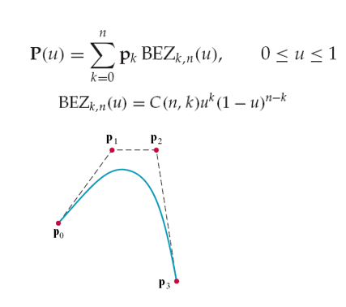
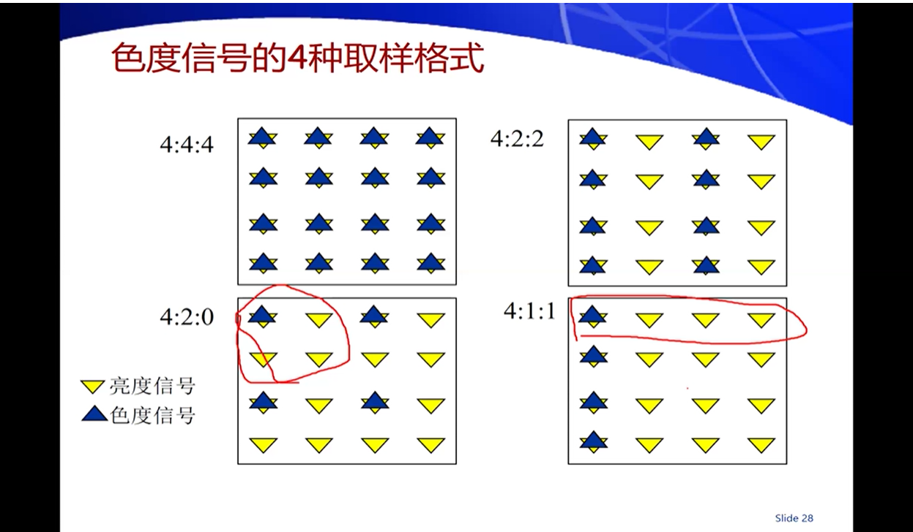
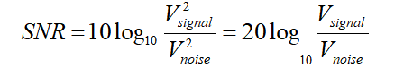
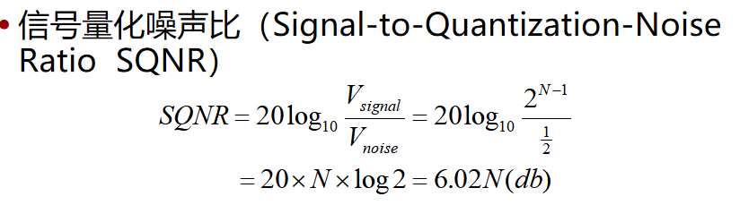
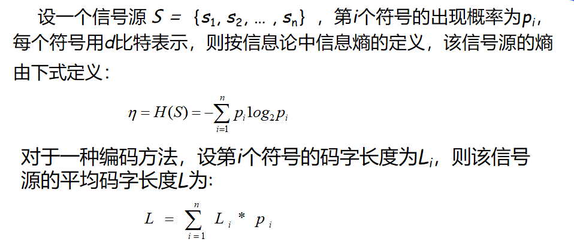
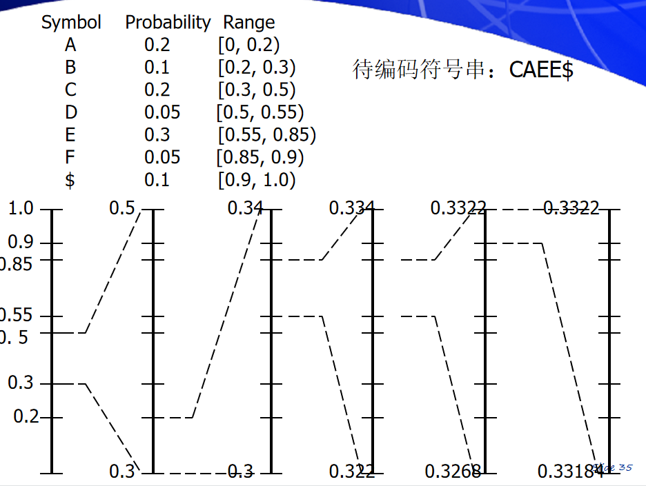
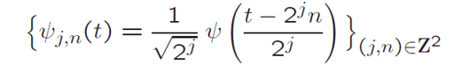

## Intro

- 目标

  - 多媒体技术在计算机上的表示（怎样表示一个视频、声音、图形）

  - 掌握多媒体编码标准

  - 当前的多媒体处理技术和相关算法
- 什么是媒体
  - 媒体（Media）：发布信息，表现信息的手段、方法、工具、设备或装置
    - 两种形式：
      - 感觉媒体：人——人 或 人——机交换信息的形式（可以通过视觉、听觉 感知到）
      - 表示媒体：计算机内部或机——机交换信息的形式（二进制编码形式存储）：称为数字媒体形式
    - 感觉媒体和表示媒体的转换（输入设备、输出设备），是主要研究部分！
    - 按生成属性分类
      - 自然媒体：客观世界存在的。。。经过特定设备，进行数字化和编码处理后得到的 **数字媒体** （如：Digital video，Bitmap image）
      - 合成媒体：以计算机为工具、采用特定符号、语言、算法表示等，由计算机生成（合成）的文本、音乐、动画等等 （如MIDI？graphics，computer animation）
      - 两者区别：
        - 1.客观世界存在否；
        - 2.表示方式：
          - 自然媒体：离散样本方式；
          - 合成媒体：由符号、语言、算法 所表示的
  - 啥是多媒体？ any combination of text, graphic art, sound, animation, video delivered by computers
  - 多媒体技术：可以大大提高人机交互效率（各种人机交互接口）

- 多媒体技术的研究内容

  - 各种媒体输入 $\to$ 媒体的表示（编码） $\to$ 媒体的编辑（对媒体信息的一些修改？） $\to$ 媒体的集成（多种媒体的同步、集成等等） $\to$ 媒体传输（一般是网络） $\to$ 媒体消费（*要把表示媒体 转换为 感觉媒体！）

  1. 媒体的输入
     - 自然媒体：通过捕获 & 数字化（自然界中真实存在）
       - 将物理量、化学量、生物量等转换成**电信号**（如麦克风把声波 从 机械信号 转换成 电信号）
       - 然后通过采样、量化、编码等处理，将**模拟电信号** 转成 特定格式的数据文件
     - 合成媒体：通过建模（通过专门的算法、语言、脚本来描述）
       - 创建：先建模，得到 采用特定符号（语言）或某种算法表示的媒体（如编码文本、MIDI音乐、计算机动画、Graphics。。。）
       - **渲染**：最后展示的时候，要转换为 感觉媒体（离散的样本点）
         - 渲染 就是将合成媒体，转换为离散样本
  2. 媒体的表示
     - 文本编码
     - 声音编码
     - 图像编码
       - 多分辨：一个图像可以支持多分辨率，即根据当前场景的复杂程度，选择不同分辨率
     - 视频编码
       - （以上三个都：）压缩问题 和 传输问题
       - 可伸缩性：一套码流 支持多种分辨率（标清：只解析标清码流；高清：同时也解析高清码流。。。）
     - 编码标准：
       - 音频：MPEG
       - 图像：bmp，gif，**JPEG**
       - 视频：H系列（要求编码解码实时性），MPEG系列（不要求编码，但要求解码实时性）
  3. 媒体的编辑（editing）
     - 内容增删改；变换、效果处理；布局安排；类型转换（自然形式（媒体）的取样表示 $\to$ 符号化 $\to$ **符号表示**）
  4. 媒体的传输
     - 网络传输
     - 载体发布：CD、DVD、HD DVD、蓝光Disk
  5. 媒体的消费
     - 文本：浏览、阅读
     - 图像：渲染
     - 等等

- 多媒体技术的发展
  - 网络化

## 文本编码

- ASCII码：7位二进制编码；96个可打印字符+32个控制字符
  - 一般ASCII码为：ISO-646-US标准；也有其他本地化版本（ISO-646-）
  
- 扩充ASCII码（ISO-8859）：8位二进制编码（低位兼容ASCII（0+7位）；高位从0xA1开始定义，分为若干不同的字符集）

- 汉字编码：GB2312-1980：（简体中文字符集，+ASCII码等西文字符）
  - 区位码（8bit）+基类码（8bit）（94个区+94个位）
  - 存储时，为了和ASCII码区分，**将区位码 和 基类码都加上A0**（单字节的最高位置为1）
  
- GB12345-1990：
  - 繁体汉字编码（专门用来编码繁体的）

- CJK（中日韩）

- GBK（GB2312 + CJK + ...）
  - 双字节编码，第一字节最高位必为1，第2字节最高位不一定！（仍能和单字节的ASCII码兼容）
  - 与GB2312-80向下兼容
  
- UCS：将所有字符统一在一个字符集中（留了00 0000 0000 到10 ffff ffff的编码空间）

  - UCS的变形显示形式之一UTF-8（可变长形式编码）
    - 

  - UTF-16：两个字节一起来读入（允许插入一些4字节的UCS-4字符）：
    - 读入两个字节：如果在D800到DFFF之间，则表示是四个字节的字符，否则两个字节
    - UTF-16能表示UCS中的全部字符

## 数字图像基础

- 颜色模型
  - 颜色三要素：
    - 色调：颜色的外观，决定于光的波长
    - 饱和度：纯度/彩度（彩色中含白光的量）
    - 亮度：强度，能量
  - 颜色模型：
    - 加色模型RGB；减色模型CMY(K黑)
  - 抖动：
    - 用空间换效果
  - 八叉树颜色量化算法！
  
- 图像与图形
  - 图像（Image）
    - 取样图（点位图）：图像的空间离散化
  - 图形（graphics）
    - 矢量图：通过计算机指令表示
  
- 数字取样图像的表示
  - 分辨率（屏幕、图像 分辨率）
  - 像素深度（存储每个像素所用的位数）
  - 调色板（颜色查找表，只需存储索引）
  
- 常用图像文件的格式
  - bmp：windows通用的图像文件格式
    - 包含：文件头，信息头，调色板，位图数据
    - 位图数据：扫描行是由底向上存储的，这就是说，阵列中的第一个字节表示位图左下角的像素，而最后一个字节表示位图右上角的像素。 一行的字节数必须为4的倍数。
  - gif：颜色少（不超过256），特别小；图像中可加入文本
  - png

- 合成图像（与数字取样图像相对）的创建与表示

  - 合成图像：使用算法或几何要素以及材料性质，来描述形体；显示时，会根据观察者位置以及光线来生成景物

  - 建模方法：

    - 几何造型技术：线框模型、表面模型、实体模型

      - 线框模型：点和棱边，没有面，不能表示含曲面物体

      - 表面模型：面的集合表示物体，环界定面的边界；但不能计算体积、表面积等

      - Bezier样条曲线函数：有$p_0, p_1,\cdots, p_n$n+1个点，以此模拟出一条曲线：（除$p_0,p_n$外，其他点都仅提供方向信息，一般不经过）

        

      - 实体模型

    - 过程造型

      - 分形几何：初始图形的每一点，不断重复使用给定的变换函数（固定的或随机的）
        - 如：三角形（初始元）+每边突出一个角（生成元generator）
        - 统计自相似分形几何构造：重在随机性（如模拟叶脉）
      - L系统
      - 粒子系统
      - 基于物理的建模

- 数字图像的展现

  展现：将取样/合成图像从内部表示转换为在图像输出设备上可见的视图

  ​	包括：reconstruction：取样图像 展现到输出设备；rendering：合成图像 展现到输出设备（比较复杂，计算量很大）

  - CRT显示器：阴极射线（控制信号 控制电压大小），同时只有一束电流！（不断一行一行发射）
  - 液晶显示器：通过改变光的振动方向，来控制显示强度（有一个配光板，只有某一方向震动的光能通过）
  - 显示控制卡（or图形卡、视频卡、图形加速卡、视频适配卡，显卡）
    - 包括：显示存储器（VRAM），GPU，绘图与显示控制电路
    - VRAM：存储正在显示的图像数据（双缓存：还存储下一帧要显示的内容）；以及作为GPU的内存！
    - GPU：以及将RGB数字信号转换为模拟信号
    - 绘图与显示控制电路：对CRT或液晶显示器进行控制，与CPU一起完成图像生成与更新。
  - GPU（graphic processing unit）：
    - 主要为了大量的、并行的数据计算：**渲染！**（rgb$\to$模拟信号）
    - NVIDIA的GPU：CUDA核心（通用GPU核心！可以像在CPU上编程一样在GPU上编程，也可以图像渲染）；Tensor核心：专为张量和矩阵计算（深度学习）
  - 图像绘制过程：
    - 光线跟踪方法（ray tracing）
      - 正向效果：光源处发出无数光线，在到达表面上反射、折射，直到部分光到达投影平面（/反射、折射一定次数）
      - 逆向效果：以像素为起点
      - 添加阴影（通过光源+建模和算法计算得到）、表面细节、纹理、材质
    - 方式：点绘制、面绘制、体绘制
    - rendering pipeline：（OpenGL）
      - 需要定义：光源，观察点（视点），成像面，距离，大小。。。
      - 景物的模型$\to$取景变换（坐标变换）$\to$视域裁剪（快速判断哪些物体在视域内）$\to$三角化（把所有景物转化为三角网格mesh）$\to$光栅化$\star$（关键步骤，所有可视对象转化为像素！一般通过光线追踪实现）$\to$隐藏面消除（保留最靠前的对象像素，还要考虑透明效果、折射反射效果）$\to$明暗处理$\to$阴影生成$\to$纹理映射$\to$最终景物的像   （此即rendering pipeline全过程）
    - 纹理：用一些算法，将真是的照片蒙在mesh上，不影响几何形状；几何纹理：对几何形状也会产生一定扰动（如一个高尔夫球）
  
  - 合成图像的展现

## 数字视频

- 模拟视频：随时间变化其内容的一组图像（n帧/秒），又叫运动图像
  - 彩色电视图像摄取、传输和重现的过程：拍摄和播放都采用 **光栅扫描** 方法（依次扫描成像平面每一像素）
  - 彩电信号传输：用Y（亮度）、C1、C2（色差信号，与彩电制式相关，比如我国用PAL制式、美国用NTSC制式）
  - 显示：光栅扫描（**逐行扫描**；也有 隔行扫描interlaced（奇数场+偶数场$\to$1帧图像），**隔行扫描** 转化到逐行扫描 可能会造成模糊）
  - 视频信号：
    - 空间特性：需要有时间回扫（行回扫、列回扫）；一般宽高比为4：3或16：9
    - 时间特性：动作连贯要求 帧频>15f/s；无闪烁要求>50f/s
      - PAL：每秒50场（隔行扫描）；NTSC：每秒60场。计算最（亮度信号）高频率时：全屏光点总数$\times$每秒帧数（场数除以二）**/2**（因为两个像素构成一个周期）
      - 载波频率：PAL：8MHz；NTSC：6MHz
    - 电视信号的彩色空间：Y（亮度信号）,C1,C2（色差信号），根据RGB转换
      - 为啥要用？：因为彩色电视信号 与 黑白电视兼容；利于压缩信号带宽
    - 视频信号种类：
      - 复合电视信号：将 亮度、色度信号 以及同步信号 复合成单一信号。适合远距离传输（只需要单信道）
    - 接口种类：梯形的 HDMI高清信号；宽体型（15根信道）VGA

- 数字视频：易于编辑、修改、存储、传输，图像质量更好

  - 视频信号数字化：模拟视频信号输入：Y、U、V（模拟视频信号是连续的，时间和幅值上都是）

    - 1.滤波（过滤掉噪声）；2.取样（时间轴上（和x轴y轴？）离散），亮度信号采样频率13.5MHz；3.量化（值还是连续的，用8-10bit表示一个信号）；4.PCM编码（1.协议：如何解释这些比特流；2.压缩：数据量过大）=>数字Y、U、V信号

    - 取样：Y分量：标清水平分辨率720（一行 有720个像素可见）；垂直分辨率：PAL：576行可见；NTSC：480行可见（因为JPEG编码，需要按16×16的块）

      U、V/I、Q：人眼对其不如Y信号敏感，因此不用每个采样点都有

      

  - 数字视频的计时：00;02;51;20（小时；分钟；秒；帧）

    - 失落帧编码：00;02;51;20（分号），用于处理NTSC的实际频率为29.97fps：每一分钟的00秒，没有00和01帧；每十分钟的00秒，有00和01帧（类似闰年）
    - 非失落帧编码：00:02:51:20（冒号）

- 计算机合成视频

  - 计算机动画：采用计算机合成，可供**实时**演播的一系列画面 的技术（是合成数字视频）
  - 运动控制
    - 类别：刚体运动：一些关键部件组成，不变形，仅相互位置关系变化；变形体运动：不仅相互位置变化，而且也变形
    - 运动控制的方法：
      - 关键帧人工给出几个关键帧的位置、形状、方向等等；中间帧靠计算机自动合成
      - 计算法：（抽象成物理、数学模型）动力学（受力、加速度。。。）、随机方法（火焰、云彩、瀑布等，需要添加一些随机方法）、行为规则
      - 运动捕获：现实的运动图像捕获（记录许多样本点的运动）（如人脸的表情）
      - 重用以前的动作

## 声音

#### 声音的数字化

- 声音：
  - 物理特性：频率（音调，音高）；强度/振幅（音量）；波形（音色）
  - 次声：0-20Hz；可听声：20-20kHz；超声：20kHz-
    - 可听声中，分 语音（300-3400Hz） 和 全频带声音（20-20kHz）
  - 声谱图/频谱表示：在某一帧（时间点），各个频率的音波的振幅
- 声音信号的数字化：
  - 模拟声音信号（机械波） —> 取样：（模拟的电信号，时间上离散，值上连续）声音不失真，采样频率至少要为信号最高频率的2倍（语音信号，采样频率一般就8kHz；CD则是44.1kHz（可听声最高20kHz））
  - —> 量化：在取样值上也进行离散（量化精度）
- 数字波形声音的基本参数
  - 取样频率（每秒呈现多少个样本）；量化位数（决定了还原的质量）；声道数目（单/双）；压缩编码方法（压缩倍数）；比特率/码率（每秒钟的数据量，由前四个参数计算得到：1x2x3/4）
  - 信噪比（SNR）：（评估一段信号的质量）
    - 单位是分贝
  - 信号量化噪声比（QSNR）：量化之后 可表示的振幅数，和舍入误差比

- 非均匀量化：量化间隔 不等；为了适合人耳听觉（低幅值区分明显，高幅值区分不明显）
  - 对原样本先做一次μ/A律压扩算法，再对得到的样本进行线性量化取样（**最后输出还要转回去吗？**）

#### 合成语音

- 语音基础知识：
  - 音素：元音（浊音）；辅音（浊音或清音）
    - 浊音声带振动；清音声带不振动。对于语音合成，浊音和清音合成方式不同！
- 文语转换：
  - 文本—> 分析：（发音规则库）通过编码查发音（辅音 元音），发音标注；（韵律规则库）韵律分析：根据各种，得到韵律控制参数
  - 合成语音：从发音，得到波形；然后对波形进行一定修饰
    - 两种方法：参数合成；波形拼接
- 参数合成法：把人的发声抽象为 激励信号，经过滤波器，得到一段波形
  - 每个字（的语音），都通过一系列参数合成得到，包括激励信号、滤波器信号等等？
  - 音素库小，需要的bit少（只需存那些参数）；但音质差
- 波形拼接：记录一个人的字词发音，记录下波形在波形基元库中，最后进行一定修饰
  - 语音基元波形库（预先存储大量语音基元（字或词）波形，合成时按字/词读取基元波形）
  - 波形拼接+韵律修饰

#### 合成音乐

- 基本概念：
  - 用乐谱描述，由不同乐器演奏
  - 音符：音调，音色，音强，持续时间

- 波表合成器：类似与语音合成的波形拼接？
  - 存储各乐器的各音符的数字化波形于波表
  - 播放的时候修饰成需要的音强和时长

- MIDI（Musical Digital Interface）：

  - 记录乐谱，而非波形信号

  - 输入设备：根据人们的演奏，通过MIDI接口传输给音序器
  - 音序器：组织好音色、节奏、音符等等音序信息，让音源发声（MIDI文件）
  - 音源：里有合成器，有且仅有16个channel，MIDI文件中的各个音轨（track）必须要映射到其中一个channel；每一时刻，一个channel只能演奏一种音色！但可以多个乐谱（4把小提琴同channel）；总共支持128种音色

  - 优点：数据量小，易于制作和编辑修改（只需要改乐谱）

  - 缺点：表现力不行，音质与硬件相关

    

## 压缩算法

#### 无损压缩算法

- 基本概念

  - 图像数据压缩的可能性：
    - 时间、空间冗余；信息熵冗余（可变长编码，给出现多的短编码（问求提到过））；等等
    - 信息熵η$\div$平均码长L，越大（接近1）越好

  - 数据压缩的性能指标：
    - 压缩比：压缩倍数，压缩效率，bits per pixel（bpp）
    - 算法复杂度
    - 重建质量：
      - 客观法：均方误差；信噪比等（见ppt7：p7）
      - 主观法：虽然受评价者本身影响，但在应用方面更加准确有效
  - 压缩编码技术大概思想：
    - 统计（熵）编码：统计符号出现概率，给出现概率高的符号短码字
    - 预测编码：（图像/视频/音频数据 时间/空间冗余）已知像素（块）预测相邻/下一帧 像素（块）；
      - 对差值编码，减少编码位数
    - 变换编码：对图像进行空间上的正交变换
      - 比如一个正弦波，与其记录其每一时刻的波形，也许可以变换到另一维度（数学公式？），只需记录其频率，振幅
      - 傅里叶变换；还可以通过机器学习

- 行程长度编码（run length code：RLC）
  - 对于连续出现同一数据序列如55555000111，表示为：553031
  - 二值序列：00001110000001101111：436214（甚至不需要记录数值）

- 变长度编码

  - Shannon-Fano编码：

    1. 统计每个符号出现概率
    2. 从大到小排列
    3. 每个集合切分，按最接近50%切
    4. 对每个集合重复3，直到其中只包括一个符号

  - Huffman编码：

    1. 统计+排序
    2. 最小的两个合并，并加入队列，排序
    3. 重复2，构建出Huffman树
    4. 为树上**每条边**分配一个编码，统一概率大者分配0，概率小者分配1

    - 编码方式可能不唯一：（编码效率都相同）但可能最长码长不同，倾向于选最长码长较短的
      - 方法就是：每次插入的时候，如果出现相等的概率，则新插入的排前面（即优先合并已有的）
    - 传输中 误码影响较大！（一旦出错， 可能后面解码全部错误）；需要先统计符号出现分布；每次需要重新计算码表

    - 自适应Huffman（例如针对ASCII码字符的）：传输过程中不断去调整Huffman树；但每一时刻，编码确定
      - 首次出现的字符，编码为前缀pre+其ASCII码编码
      - 然后将该字符插入树中，编码为pre+1
      - pre变为pre+0
      - 当树不平衡时（任何一颗子树中，左子节点权重大于右子节点权重），需要进行子树的切换（此次输入之前，同权重的两个节点对应的子树进行交换（一定是和根节点更近/靠右的），且优先和**拓扑距离最远**的节点交换！）这是为了保证编码 和 解码处的Huffman树是唯一确定的
    
  - 字典编码：（LZW编码）
  
    - 思想：给信号源中的各符号序列 编码（建立编码表）；当下次再出现时，直接用编码即可；一般编码的码长为12bit
    - 编码过程：读入符号，直到出现未见过的符号序列S+c，将S的编码输出，并为S+c编码，c作为下个S的开端；**初始时，符号表中有确定的单个符号编码，编解码处应当相同！**
    - 解码过程：初始符号表中有同编码表中一样的每个单个符号的编码；读入编码，并将对应的符号串输出以及压入buffer，buffer中同时只有两个符号串；将buffer中上个符号串S1+当前符号串**S2[1]** 作为新的一个符号串编码写入符号表！剔除S1，继续读入
    - 解码有一个问题：当刚刚新编码的符号串 立马就使用的时候，就就会出现解码过程中不知道该读入什么符号串，此时新编码的符号串一定就是当前buffer中的唯一符号串S+S[1]！将其压入buffer并继续即可
    - 压缩效率不高
  
  - 算术编码：
  
    - 编码单位为一串符号；用[0,1)的一个半开子区间表示一个符号？符号之间不重合
    - 算法：
    - 最后的编码为该区间内 bit最短的小数！（怎么找？一个一个bit构造和试）
    - 缺点：区间表示的小数会越来越长，且区间再分时需要进行乘法运算，速度慢
      - 解决方案：区间长度A用规格化形式表示，始终保持在0.75-1.5之间？；可以用移位代替乘法
  
- 预测编码

  - 差分编码：只需记录第一列像素信息+每个像素与左侧像素的差值，希望来降低编码所需bit
    - 一般用在有损编码
  - JPEG无损编码格式：
    - 用相邻像素预测此像素信息，编码解码确定一个统一的公式：X=a1A+a2B+a3C；只需要记录预测 与 原像素的差值（需要的bit少）。其中A,B,C都是编码再解码后得到的像素信息

#### 有损压缩算法

首先需要评估信息损失的程度，以及对信息丢失的可容忍度

- 变换编码
  - 编码：将数据通过变换T映射到另一个空间，使得信息主要集中在某几个维度，则丢掉/粗略处理其它不重要的维度
  - 变换矩阵：变换方法是否固定？希望正交变换
  - 解码：通过逆变换T'解码

- 离散余弦变换（DCT）：

  - 对于x轴上可积的信号f（x），可以分解成若干不同频率的正/余弦（连续 傅里叶变换？），对于**频率为u**的正/余弦信号，其系数为F(u)（是系数！不是指振幅/强度哦！）
    - 本质就是，将原本是 时域上的函数$f(x)$， 变换为了频域上的函数$F(u)$

  - 分解之后，高频部分的能量一般是较低的，可以忽略

  - 离散傅里叶变换：（频率上不再是连续的，且去掉了虚数部分）见ppt8：p9；一般N最大取8
    - $\tilde{f}(i)$表示逆DCT，从变换后的值，再重现出原$f(i)$
  - 有点像变换编码？只不过现在把n维的向量信息看作了一个n个采样点的波形图，对它进行离散傅里叶变换，分出的每个余弦波（F(0)是直流信号的系数），实际也是一维坐标

  - 还有二维（2D）DCT变换：8x8，频率从左上到右下递减（频率：u[2,2] = u[1,3] = u[3,1] = 1）：基函数就是二维的余弦函数呗
    - 

  - 缺点：对脉冲信号不太行！且会对原图像进行分块压缩，则解压出的图像产生“方块”效应

- 小波变换

  - 小波：
    - 一种函数：具有**有限的持续时间**、**突变的频率和振幅** 波形可以是**不规则的/不对称的**，在整个时间范围内的**积分为0**！ 有好多种小波
    - 首先 可以进行连续小波变换（CWT）：即将任意波形 分解为**一段母小波**的各种平移、缩放变换得到的小波的叠加；
      - 由此，就有了 **各种小波分解**（Haar小波分解只是其中之一）
    - 接着有了 缩放 和 平移 均为2的j次幂的倍数 构造平方可积的实空间$L^2(R)$的规范正交基
    - 平移和缩放：在同一频率上，通过平移来拟合波形的不同分段；然后再缩放，在新频率上再重复上步
    
  - DWT：discrete wavelet transform

    - 做法：想想data mining？（1D）

      - 低通滤波器输出（保留信号中的低频成分，消除高频成分，得到模糊的信号）：原波形的两个数值的平均；
      - 高通滤波器输出（消除低频成分，保留高频！）：前减后的差/2
      - 分成若干Haar小波的系数

      - 分析滤波器：高通+低通+下采样（否则会有冗余/重复）
        - （5，3）整数滤波器：可以无损（无损和有损的统一！根据解码的程度来决定）
          - 例如低通滤波器：$h_0(n)=$(-1 2 6 2 -1)/8      0 +-1 +-2：表示计算第n个值时，应该：（6\*cn + 2\*cn-1 + 2\*cn+1 + -1\*cn-2 + -1\*cn+2) / 8
          - 高通滤波器：$h_1(n)=$(-1 2 -1)/2    0 -1 -2：同理，-1，-2表示前1、2个，从左到右一一对应；别忘了最后除2！
        - （9，7）浮点滤波器：一定有损
      - 合成滤波器：上采样（先补0）+高通+低通+合成：注意顺序
      - **继续对低频信号，可以进行多级小波分解**，也有同时还对高频信号分解的

    - 2D DWT：先对行进行低通+高通+下采样；然后对得到的 **低频信号 **和 **高频信号** 都分别对列进行低通+高通+下采样

    - DWT的优点：多分辨率；不会产生块状效应（与DCT相对）；可对脉冲信号分解；单一码流中可既无损又有损！

- 嵌入零树小波系数（EZW）

  - 比特平面编码：
    - 编码顺序为：按比特平面 从高到低，优先扔 **最高频率的 最低有效位**的比特

  - 零树结构：基于位平面编码（2-D DWT）

    - 父子结构：一次平面DWT中，低频信号 为外置位同位置的块的父亲

    - 系数的分类：（4类，每种系数用2bit表示）

      - 零树根t：绝对值比阈值小，子子孙孙（绝对值？）都比阈值小
      - 孤独零z：绝对值比阈值小，但子子孙孙中有（绝对值？）比阈值大的
      - 正大系数p：有一个阈值，若比阈值大
      - 负大系数n：绝对值比阈值大但为负？
      - 用来确定 哪些位置上的值，在某些位置上是1

    - 逐次逼近量化（SAQ）

      - 用到两个表：主表，辅表
      - 主扫描：
        1. 找到绝对值最大的系数n，阈值设为$th=2^m \leq n < 2^{m + 1}$
        2. 按块，从左到右，从上到下扫描，依次确定tzpn，写入主表
        3. 对于t，其所有子孙都不再扫描
        4. 将所有p和n对应的系数存入辅表（哪些系数在第m位为1）
        5. 将正/负大系数们原位置设为0
      - 辅扫描：
        1. 继续**细分**那些正/负大系数们的区间（通过新的阈值来划分区间）（存入辅表）

      - 循环主辅循环（阈值直到1，则为无损），上为编码过程

      - 解码：
        - （主）同样的顺序，对于t，就将它的所有子孙 都补出0来
        - （辅）根据辅表的1/0来对所有非零项进行细化更新

## JPEG（图像压缩标准）

4种编码模式：1.无损编码（不常用）；2.基于DCT 的顺序编码； 3.基于DCT 的累进编码； 4.基于DCT 的层次编码

#### JPEG图像压缩的主要步骤

- 基本流程：

  1. RGB 转为 YIQ / YUV（亮度+色度分量，可以丢掉部分色度IQ/UV）
  2. 分块：分为8×8的块，对每一块进行2维DCT变换（离散余弦变换）
  3. 量化：（量化阶）如仅4bit，但要表示0~60：则设置量化阶位4，通过乘以量化阶来表示
  4. 分别对直流 和 交流信号 进行不同编码

- **预处理和 FDCT**（傅里叶 离散余弦变换）：

  - 首先 将RGB颜色空间 转换为 YC$_r$C$_b$空间（YUV）；
  - 然后分块，分成8×8的子块：（4：2：2的色度格式）
  - 电平偏移：对每个像素的值进行电平偏移（方便表示）
    - 原本像素值范围在\[0, $2^P-1$\]（P=8一般）；调整为范围：\[$-2^{P-1}, 2^{P-1}-1$\]

- **DCT系数的量化**：（直观理解：就是压缩！用少bit来表示大范围数据，但是每个bit之间跨度较大（量化阶））

  - 量化处理：量化后的DCT系数$\hat{F}(u,v) = round\Big(\frac{F(u,v)}{Q(u,v)}\Big)$
    - 其中量化矩阵$Q(u,v)=Q\times V(u,v)$，Q为**质量因子**，V（u，v）为**亮度/色度量化表**
    - 如：
    - Q越小，CR越低，图像质量好（损失的信息少，但非零系数少，压缩文件大小 较大）
    - 对于图像中 较为平缓的（变化不明显，DCT后高频信号基本为0的），量化处理前后 损失的信息很少，不明显；

- **熵编码**：（对$\hat{F}(u,v)$进行表示，不会丢失信息）

  - 直流系数DC$_i$的处理 **DPCM**：作差分！（只需记录 与左侧相邻块的直流系数的差）

    - 一般而言，相邻块之间的DC系数不会差太大，但是理论最大差值需要10bits表示，因此采用**变长编码**方式
    - 采用两个符号表示（SIZE, AMPLITUDE）：SIZE表示：该$d_i$所用的bit位数，SIZE固定4bit；AMPLITUDE = $d_i $= DC$_i$ - DC$_{i-1}$（$d_0$=DC$_0$），若为负，则用反码表示，如-6表示为001（110的反码）

  - 交流系数AC$_i$，zigzag 拉成一个一维数组，**RLC**（run-length code）：然后对这个一维数组序列 进行 **行程长度编码**（原本为：分别统计连续0和连续1的个数）

    - 如：
    - 行程编码：连续$n_i$个0，下一个非零值为$p_i$。。。最后全零，就记录0，0
      - 因为应用量化后，会出现很多0，所以用这种方式
    - 也采用两个符号表示：
      - symbol1：（RUNLENGTH, SIZE）：两者皆是 4bit定长；
        - RUNLENGTH：游程长度，0~15；
        - SIZE：同DPCM中的SIZE，表示AMPLITUDE（下一个遇到的非零系数）的位数
        - 若有超过15个连续的0，则将该游程切分为多段，全0游程用特殊符号：‘F0’来表示，则不需要符号2；若符号1为‘00’，则表示当前子块已结束（后全是0），也不需要符号2
      - symbol2：（AMPLITUDE）下一个遇到的非零系数

  - 霍夫曼编码：最后的输出，还要对DC和AC系数的**符号1** 进行霍夫曼编码，符号2均不变

    - 

    - 上为 固定的Huffman码表；或者指明了码表，用自定义的也行

#### 编码模式

- 基于DCT的顺序模式：流程就如上所示；码流是从上到下，从左到右的一个个块；
- DCT-based累进模式：码流不再是一个个完整块，而是可能是一个个系数
  - 频谱选择法：先输出/解码出 所有直流系数；然后依次增加交流系数
  - 连续逼近法：将所有DCT系数同时编码，最先编码MSB（most significant bit）
- DCT-based层次模式：
  - 即根据不同的分辨率层次，（提供）进行不同的程度的 压缩编码
  - 算法流程：
  - 除最低分辨率外，每一级都是对**差值图像**进行JPEG编码！
  - JPEG用的很少

JPEG的压缩比与图像质量：

- 压缩比（CR）：CR是一个大于1的整数
  - CR = 原始图像数据量 / 压缩后图像数据量
    - 压缩后图像像素比特数 = 原始比特数 / CR（记住这个关系！）
  - 压缩比的控制（Q因子）：
    - 量化矩阵 Q\[u,v\] = （Q (/50?)）*V\[u,v\]
    - 故：Q小，CR小，压缩图像大，质量好
    - Q大，CR大，压缩图像小，质量差

#### JPEG2000

需要自学。。。

## Ch10. 视频压缩基础

视频压缩编码的标准

- ITU-T标准：视频会议、可视电话（主要用于通讯，对实时性要求高）
- ISO/IEC国际标准：MPEG系列，主要用于娱乐（对质量要求高，编码实时性无要求，但解码需要实时性！）
- AVI，QuickTime，RealTime

H.261：ITU-T制定的视频编码标准：最主要最重要的 ~

- 只支持图像格式：CIF（352×288像素）和QCIF（176×144像素）

H.263：

- 支持的图像格式增多了

视频数据压缩编码的依据：

- 每一帧画面**内部** 信息有强相关性
- 相邻帧之间有高度相似性
- 运动可估测
- 可利用人眼的视觉特性

#### 视频压缩的基本方法

空间域：通过JPEG压缩算法 去掉画面内的冗余信息

时间域：采用**运动补偿**算法来去掉画面间的冗余信息

**运动补偿**：

- 不要整张画面编码，而是对于每一块，从前一帧中 找一块最相似的块，编码这两块的差值

1. 首先 将**要编码的帧**画面划分为宏块（16×16，由4块JPEG块组成），以宏块为单位，找出两帧画面中相应宏块的位移关系——**运动矢量**

   - **$\textcolor{red}{注意}$**：参考画面（即上一帧，以编码好的画面，以编码后再解码出来的画面为准！**而不是原画面**！）不需要划分为宏块；参考画面中的宏块可以在任意位置！

2. 运动矢量的估计：参考画面中搜索对应宏块

   - 范围：2p+1：即参考帧中，该宏块的水平 和 垂直位移i，j都必须在范围\[-p, p\]内

   - 找到最佳匹配块，最佳匹配块 相对于 该宏块的偏移量，称**运动矢量**，保存在输出码流中；

   - 只需编码 宏块与 最佳匹配块的差值

   - 最佳匹配准则：”方差和“SSE最小 or  ”绝对误差和“SAD最小（M：mean；S：sum）

     - 搜索精度：1 pel；（也有0.5 pel之类的）
     - 

   - 搜索方法：

     - 顺序搜索：2p+1 × 2p+1个位置，依次计算每个运动矢量 对应的MAD（or。。。）
     - 对数搜索法：（每次计算中 + 周围8个点（初始步长为1/2p）；找最匹配的，然后缩小步长为一半）

     - 层次搜索：
       - 分为k层，第k层 会对宏块 和 搜索范围 进行$2^k$的下采样，然后找到最佳匹配；
       - 若第k层的运动矢量估计值为$(u^k, v^k)$，则k-1层将以$(2u^k,2v^k)$为中心，在**3×3的区域**内搜索
       - 直到找到第0层的最佳匹配块
       - 这种方法 计算效率最高（**可是为什么要乘3？**：3是指每个像素比较 需要三个操作完成）

#### H.261

将视频的每一帧划分为了2种：

- I帧（帧内帧 **Intra**-frame）：独立的，不需要作预测，直接按JPEG方法编码；必须要有I帧
- P帧（帧间帧  **Inter**-frame）：作预测编码（运动补偿）

H.261的量化：（与JPEG的区别）因为对实时性要求高，因此作了一定简化

- 没有量化表：8×8个系数的量化阶 都相同（2*（1~31）之间的一个数）
  - **特例**：I帧的量化阶 都是8

**H.261 Encoder：**（4：2：0，因此一个宏块包含4个Y块，1个Cb块，1个Cr块共6个8×8块）

- 1帧：I-frame帧内帧：直接JPEG压缩（DCT+量化）；同时对压缩后的数据 作逆量化+逆DCT，存在帧缓存中（辅助 帧间帧P-frame 运动补偿）
- 2帧：运动补偿模块：输入：P-frame数据+帧缓存中数据；输出：运动矢量mv（moving vector）
- 对于P-frame的每个宏块，根据mv得到帧缓存中画面的一个宏块，与原宏块作差值D，对D再进行DCT+量化，得到输出码流
- 更新帧缓存：对编码的差值D进行逆量化+逆DCT，与原本帧缓存中画面相加，得到新的帧缓存画面
- 3帧：继续下一帧。。。

- 量化阶回调：需要稳定的码流（每秒多少KB的数据）；则根据一定方法判断：
  - 剩余空间不足：则增大量化阶，之后的帧 减小 但质量差；
  - 剩余空间较多：则减小量化阶，之后的帧 图像质量提高

**H.261 解码：**

- I-帧：直接解码输出，存入帧缓存；
- P-帧：解码+帧缓存 => 输出，并更新帧缓存

**H.261视频位流语法**：

- 宏块组（GOB）：

  - 将 3行 * 11列 个宏块，作为一个宏块组（176×48）；每个宏块组都有个编号

  - 以宏块组为单位，进行网络传输（网络层，一个图像帧中 包含多个GOB）

- 图像帧：

  - 图像层：
    - 有同步头（17个1）
    - 时间戳（几分几秒第几帧）
    - P/I-frame
    - 各个GOB
  - 宏块组层：
    - 有同步头
    - 宏块组编号
    - 宏块组的量化阶k（该组中的所有宏块的量化阶都 × k）（选用）
    - 各个宏块（33个）
  - 宏块层：
    - 没有同步头哦~因此出错，会限制在一个宏块组内
    - 类型：可预测（则有运动矢量）/不可预测宏块
    - 宏块公用量化阶（选用）
    - MVD：运动矢量（可预测）
    - CBP：（可预测）6个bit，每个bit对应后面的一个块；第ibit为1，代表第i块全0（表示与前一帧的块完全一样），则后面就不需要再编码第i块了
    - 6个块（4Y+1Cb+1Cr，4：2：0）

  - 块层：（同JPEG）
    - DC：符号1（符号2的宽度）的霍夫曼编码，符号2（此块与上一块的差值）
    - 交流系数：符号1（行程长度+符号2的宽度）的霍夫曼编码，符号2（遇到的第一个非零值）

总览：

#### H.263

- 增加了PB帧模式；
- 视频分辨率 扩充为5种；

- 宏块组划分：一行为一个宏块组

**运动补偿：**

- 当前宏块的运动矢量MV的编码：
  - 通过预测：
  - 水平分量u，垂直分量v：$u_p = median(u_1,u_2,u_3)$，v同理
    - u，v初值：为$u_p,v_p$
  - 编码：对差值$u-u_p$（v同理）编码
  - 特殊情况：MV左是边界，则MV1 = （0，0）；MV上是边界，则MV2=MV3=MV1；MV右是边界，则MV3=（0，0）

- 半像素运动补偿：

  - 半像素的亮度色度值，是通过预测获得的：

  - A   b   B：则b点亮度色度值为：(A+B**+1**) / 2（即A的和B的亮度/色度值 + 1 除以2）

  - 落在A、B、C、D正中间，则为（A+B+C+D+2）/4

- 不受限的运动矢量
  - 扩大运动矢量范围：允许运动矢量超出图像边界，**超出部分用边界像素代替**

PB帧模式：I，P，B帧

- P帧：参考上一个I或P帧（同前）
- B帧：同时参考前一个I/P 和 后一个I/P帧
- 匹配概率增大
- 问题：1.搜索更多，效率降低；2.编码顺序改变

#### MPEG系列

Moving Picture Experts Group：主要用于娱乐方面的视频/音频（video/audio/data）编码标准

MPEG-1：将每秒200Mbps的NTSC（音视频信息） 压缩为大约1.5Mbps的（音视频复合）码流（其中视频大约占1.2Mbps）

MPEG-2：针对数字电视 和 高清视频 的编码标准

MPEG1,MPEG2：都是基于宏块的

MPEG-4：基于**对象**的 音视频编码标准（如视频中的人）；效果比1、2都要好很多

- H.264/265，也都算进了MPEG-4：主要不同是1.宏块再细分；2.还可以帧内差分（消除空间上的冗余）

MPEG-7：多媒体内容描述接口；用来快速**检索**！ 

​	各种多媒体信息，为其添加相应的 标准描述元数据（meta data）

MPEG-21：建立一个 多媒体应用框架；

##### MPEG-1

- I, P, B, D帧：（前仨同前所述）D帧，仅用每块的DC系数编码（快速预览时的小画面），单独进行编码和存储（仅MPEG-1用）
- GOP（group of pictures）：视频画面序列 被分为一个个画面组；一般有10-15帧画面；必须有I帧，P\B帧可没有
  - 画面的重新排序：

- 编码器结构：

  - I帧、P帧：与前面的H261均相同
  - B帧：对每个宏块，分别在前和后两帧画面上找最相近块；若都找到了，则求平均，然后对差值进行JPEG编码
  - 因此，可预测宏块 有3种类型：前向预测（P、B），后向预测（B），双向预测（B）

  - 运动补偿 搜索策略：（额外的一种，老版本常用的）菱形搜索（DS）
    - 即从初始MV，计算菱形周围8个点（为mv）的sad 以及 当前中心点的sad，找到最小；
    - 若是四周某点sad最小，则移动菱形中心到该点，重复上步；（关键在于，可以省去计算不少周围点（因为在之前已经计算过了））
    - 直到中心最小，再计算一下紧挨着的4个点，即可

- 缓冲器：（量化阶的调整）

  - 解码器端：以输入速率R 向Buffer（容量为B）中输入数据，每个1/P秒，从Buffer中取1帧解码好的画面

  - 假设刚取完第n帧，Buffer中数据大小为Bn，第n+1帧数据大小为dn+1，则：
  - 取第n+1帧不下溢：Bn+R/P >= dn+1；
  - 取第n+2帧前不上溢：(Bn+R/P) - dn+1 + R/P <= B
  - 则有：必须时刻满足：Bn+2R/P - B <= dn+1 <= Bn + R/P；
  - 编码器 根据这个约束不断进行量化阶回调？

- 视频比特流的层次结构：
  - 序列层：分为若干GOP（图片组）单元；
  - GOP层：单元为一帧画面（Picture），且第一帧一定是I帧；GOP层支持**随机存取**！因为Picture是按时间排序，而B帧需要依赖后面的帧
  - 图片层：单元为宏块片（Slice），slice可以在任意位置开始和结束，自定义
  - 宏块片（slice）层：单元为宏块（该层对应H.261的宏块组层）
  - 宏块层：单元为块
  - 块层：DC系数，VLC run

- MPEG-1 vs. H.261:

  - H.261只支持CIF（352x288）和QCIF（176x144）；MPEG支持SIF，以及一定限制下的自定义格式

  - 量化：
    - H.261没有量化表，64个系数的量化阶都相同（为2-64中的一个偶数）；
    - MPEG-1有量化表，区分Intra-code和Inter-code，前者各系数的量化阶都不同，后者则是64个系数统一一个较小的量化阶（较小因为运动补偿）；不区分亮度和色度分量的量化
  - MPEG-1对解码端的缓冲要求更高（因为B帧）

- 缺点：主要是分辨率 不够大；

**MPEG-2**

- 多规格：
  - 支持各种分辨率最大可达16000×16000；
  - 每秒可达60帧
  - 支持 隔行、逐行 扫描

- 分类分级：类（5），算法复杂度（高级 兼容 低级）；级（4），支持的分辨率
  - 类：simple，main（最常用），SNR scalable，spatial scalable（前四种 色度格式：4：2：0），high（色度格式：4：2：2）
    - 可伸缩性scalable思想：即 码流中包括：基础层+若干增强层；仅解码基础层，则是低分辨率 且低质的图像；同时还解码增强层，则叠加可获得 高分辨率/高清 等等的画面
  - 级：

**MPEG-4**

概述

- 综合性：自然音视频对象 与 合成音视频对象 的集成（码流中可以同时包含自然/合成媒体对象，且合成也是用合成的方式编码）
- 交互性：选择播放，超链等（与**码流**交互！比如可以与视频中对象 进行交互（就像游戏））
- 高效率的压缩编码：与MPEG-2同等质量情况下 压缩至1/10

可视对象编码

- 第1代视频编码：单位是块（pixel），编码块的纹理texture 和运动motion（与MPEG-1/2同）

  - 不足：与人的视觉本质不同；同一对象的块运动应该差不多？不易控制场景中的不同对象

- 第2代视频编码：基于object作编码（需要进行 对象的挖掘，将对象从视频画面中检测出）

  - 一段帧序列中，检测出若干个object，并以object为单位编码：包括对象的形状、纹理、运动

  - 场景：由媒体对象 以层次方式 组合而成（树），叶节点是初级媒体对象：

    - 初级媒体对象：静止图像（固定的背景）；视频对象；音频对象；其他（文字/图形）
    - 可自然媒体，也可合成媒体。体现出综合性！
    - 以对象为单位，对象树为结构，则方便与视频流进行交互
    - BIFS：场景的二进制格式；用场景图表 表示：
      - 节点：描述视听对象 及其属性；
      - 图结构：描述各对象 空间和时间上的关系

  - VOP的编码：

    - 一个VOP 是一个VO在特定时刻的快照（形状、运动、纹理）

      - 若把整个矩形视频帧 当作一个VOP，则MPEG-4退化等同于MPEG-1/2

    - 每个VOP 定义在一个矩形边界框内（长宽 必须为 整数个宏块×宏块），且左+上边界，由VOP的左上决定，然后分宏块，如：

    - 运动补偿：仍以16×16宏块为对象，但搜索范围 只在参考帧中对应VOP的范围内（也先要找到参考VOP的矩形边界框bounding box）

      - **填充**步骤：对于边界宏块，VOP外的部分 需要进行填充 预处理（对参考VOP）
        - 对边界宏块：先 水平重复填充；再 垂直重复填充（复制边界值，若在俩边界之间，则用平均值）（如图：该图是一个缩小的宏块）
        - 对外部宏块：（边界框内VOP外，与边界宏块相邻的宏块）进行扩展填充
          - 按照左、上、右、下的顺序，依次用相邻的边界宏块（or已经填充了的外部宏块）的边界像素值 进行扩展填充
      - 计算SAD: 增加了一个MAP（p，q），仅当C(p,q)为目标VOP中的一个像素使，MAP(p，q)=1，否则为0（用来忽略掉VOP外部像素）

    - 纹理编码：即 灰度级/色度的变化 和 样式

      1. 基于DCT的纹理编码：边界外部分全填0
      2. 边界宏块的 形状自适应DCT：
         - 1D DCT-N：1D DCT的变体：DCT中固定了N=8，将时间域上的8个样本点，DCT为了8个频率域上的点（系数）；但这个N可以变为其他数
         - SA-DCT是一个2D DCT：是两次DCT-N的叠加；应用于边界宏块的每一个8×8的块
         - 对于8×8块：将VOP像素点 向上平移（俄罗斯方块）；按列作DCT-N，N为该列像素数；然后左平移，并按行作DCT-N；**最后需要记录初始形状**（二元掩码）
           - 形状记录，和下面的同理

    - 形状编码：

      - 二元$\alpha$图：每一位的值，1/0表示该位置像素是/否在VOP内

      1. 二元形状编码：将图分为16×16的块（二元$\alpha$块，BAB），只需要特殊处理 VOP边界的BAB（其他块 要么全0，要么全1）
         1. MMR 修订修改读算法：忽略
         2. CAE 基于上下文的算术编码：
            - 思想：边界BAB：对于当前像素，BAB内 该像素靠上临界的10个像素（的$\alpha$图）就构成了上下文，共1024种情况；可以用先验概率，构建一个概率表，表示这1024个上下文的出新频度。将当前这个像素 用其上下文的概率 替换（相当于1024个字母中的一个）；16×16 每个像素都这样，最后算术编码 => 32位浮点数
            - （左：I-帧边界BAB；右：P/B-帧（需 运动补偿的）边界BAB）
            - 是无损的！

- MPEG-4视频流结构：5个层次，都**支持随机访问**

  - 视觉对象序列（Video-object Sequence）：VS1, VS2, ...
    - VS 对应完整的MPEG-4视觉场景，可以包含 自然/合成对象
    - 每个VS 由若干个视觉对象Visual Object组成
  - 视觉对象VO：每个对象由若干个 视频对象层VOL组成
    - VO对应场景中的一个对象or背景，可拥有任意形状
  - 视频对象层VOL：Video Object Layer
    - 支持多层可扩展编码：一个VO 在可扩展编码下拥有多重VOL；非扩展编码下 拥有一个VOL（基础层）
    - 由若干视频对象平面组GOV or 直接由若干 视频对象平面VOP组成
  - 视频对象组GOV：（可选层）由若干 视频对象平面VOP组成
  - 视频对象平面VOP：描述：形状、运动、纹理

合成对象编码

- 网格Mesh：多边形组成的二维平面区域的一部分，顶点为网格的节点；一般都是三角形网格

  - 主要性质：几何（坐标）；拓扑（哪几个点之间构成网格）

  - 类型：（基本都是用Delaunay网格）

    - 均匀网格：

    - Delaunay网格：组成网格的三个点的外接圆内 没有第四个点 => 只要有了点阵，那么网格划分 就是确定唯一的！
      - 只需要记录 点的几何，而无需记录拓扑
      - 如何记录几何？先记录最外围一圈的点，按x+y递增（同则y递增）顺序；内部点就任意顺序了
        - 除第一个点坐标外，其余点都是记录差分！？

  - 2D网格运动编码：

    - 网格点的运动，可由与之相关的2点的运动矢量 做预测编码（e=MV - pred）；第一个MOP三角形运动确定后，所有与之公用1边的网格点也可以进行预测编码，不断重复该过程编码（BFS顺序）

## Ch.13 语音的压缩编码

**引言**

- 可听声中，分 语音（300-3400Hz） 和 全频带声音（20-20kHz）
- 因此数字化时的 采样频率（不失真）：语音8kHz，全频带40kHz
- 基础知识：1.数字语音信号（如原始模拟信号对应的PCM信号），要输出还要再转会模拟信号（在**时间上连续**的信号，就是模拟信号！），但这样得到的是**阶梯形信号**！根据傅里叶分析理论，该信号包含无穷多的**高频信号**，因此为了消除额外引入的高频信号，将这个阶梯形信号 通过一个 **低通滤波器**，过滤掉所有超过**原始模拟信号频率最大值**的信号，如此就得到了平滑的模拟输出信号！
- 2.如果不对数字语音信号做压缩扩展，则每个采样点需要13位（12位+1符号位）描述（均匀量化）；但人耳对于高音的变化 和 低音的变化 响应程度是不同的，因此会对线性量化的PCM 再做压缩扩展（$\mu$率或A率扩展），得到对数量化信号，且每个采样点只需8位描述；
- 3.$\mu$率压扩公式：
- A率压扩公式：

- 但是直接使用这些公式不太现实（因为涉及浮点运算，很复杂），故实际应用时，采用的压扩算法：

- 其中符号位保留，红色丢弃

**数字语音的波形编码**

- 只考虑语音的波形状况
  - 通用（无论是不是语音，都可以这样编码）；质量好
  - 压缩效率不高
- 三种波形编码方法
  - G.721，G.723。。。标准
  - $\mu$率编码的PCM（Pulse Code Modulation脉冲编码调制）：即量化后的采样输出，不压缩，是**无损声音**
    - PCM主要解决：将线性量化的波形 转化为 **对数量化**
    - PCM流程：输入：采样到的数字声音 => 带限/带通滤波（只保留300-3400kHz的波形）=> 取样（每秒8k个样本）=> 数模转换 （按13位（1符号+12幅值）做**量化**），得到13位的线性PCM => 再进行压扩算法，得到每个样本8位的 PCM码流
    - PCM码率为：（每秒）8k×（每个样本）8b = 64kbps
    - PCM的应用：（是不压缩的，无损声音）通信：长途电话的传输；CD，DAT的全频带数字声音的存储
  - ADPCM：（Adaptive Differential）自适应 差分 PCM
    - 差分：通过已有样本，获得预测值；编码 预测值的差值
    - 自适应：1.预测时的系数自适应；2.自适应改变量化阶（影响到差分编码的精度 和输出的码流）大小
    - 差分编码时的量化阶：如图所示
    - 其中的16 就是量化阶（可以自适应去调整，使得E较小时，采用较小的量化阶；大时再用大的）
    - ADPCM的码率 相较PCM 又降低了一半
  - 64kbps的声音子带编码：
    - **采样**时 先按照频率 分若干的子带：
      - 低频部分：采样率可以较低，而增加每个样本的比特数；
      - 高频部分：采样率高，每个样本的比特数少些

**数字语音的参数编码**

- 基于模型的 编码：将语音 抽象为 一段激励信号 经过**滤波器**过滤后得到的信号；

  - 因此只需要编码 激励信号+滤波器参数；
  - 只能处理语音、质量差；但安全
  - 编码时：从语音波形信号中 提取生成该语音的**参数**；
  - 解码时：根据**语音生成模型**，使用这些**参数**来合成出 原始语音

- 语音生成过程：

  - 假设：1.语音生成模型，每20ms左右才改变一次（期间是稳定的）
  - 2类语音：浊音（激励信号为 周期的脉冲信号）；清音（激励信号为 随机噪声）
  - 故一段语音，可分为：以20ms为一单位的，一段段激励信号（对应浊音、清音）；以20ms为一帧 进行编码

- 语音的参数编码（LPC分析：Linear Predictive Coding）

  - LPC模型的参数A = (a1,a2~a10, G, V/UV, T)：a1~a10为声道参数？；G增益参数（即激励信号的大小）；V浊音/UV清音；若是V 还有T 基音周期；参数A大约每10~30ms变化一次
  - 假设语音信号取样频率为8kHz，每秒分成50帧（20ms一帧），则一帧对应160个采样点；每帧信号近似满足同一模型（用同一组参数描述）：

  - 如何求出每一帧的 各参数呢？a1~a10 需要求解一个线性约束方程？
  - 码率超小哦~

**数字语音的混合编码**

- 通过提高**激励信号**的质量 来改进参数编码；+编码时 根据当前激励信号+参数 合成的语音信号 与 原语音信号对比，不断调整激励信号
- 最佳激励信号u（n）的生成方法：
  - 多脉冲线性预测编码MPLPC：
    - 每帧仍20ms；清音 和 浊音 的激励信号都由k个脉冲组成，每个脉冲的幅度 和 位置 待定；即对每一帧，都要去确定这k个脉冲的位置和大小
    - 数据量太大
  - **等间隔**脉冲激励RPE：
    - 每5ms一组激励信号，有13个脉冲，且**间隔相等**，只需确定脉冲的大小
  - 码激励CELP：
    - 将有限数量的激励信号 存储在存储器中（称为码本）；通过在码本中选择最优的激励信号

## Ch.14 MPEG声音

（全频带声音）与语音的主要区别：

1. 采样率高（一般44.1kHz）
2. 每个样本要16bit；2声道；故数据量远高于语音编码
3. 对编码质量要求更高

**听觉系统的感知特性**

- 响度：描述声音强弱，通常用**声强级**来描述；

  - 声强 单位：$I_0 = 10^{-12}$W/$m^2$ 
    - 意义：频率为1000Hz的声波 能被人听见的最弱声强
  - 声强级L：$L_1 = \lg\frac{I}{I_0}$贝尔（Bel）
    - $L_1 = 10(\lg\frac{I}{I_0})$分贝（dB）
  - 听觉阈电平：该频率的声音，被人听到的 最低电平（声强？）
    - 一个人的听阈 随 频率变化而变化；一般对2k~5kHz声音最明显；
    - 等响度级 曲线：尽管两个频率的声音的**客观声强级** 可能不同，但对于人来说 感觉上是一样的

- 听觉掩蔽特性：

  - 一种频率的声音 可能会阻碍听到 另一种频率的声音；前者：掩蔽声音；后者：被掩蔽声音

  - 频率掩蔽：（根据频率和声强 的掩蔽效应）

    - 同频率声音：强纯音（仅一个频率存在） 掩蔽弱纯音
    - 不同频率：弱纯音的频率 离 强纯音越近，就越容易被掩蔽
    - 纯音的掩蔽效应曲线：（曲线下的对应声强和频率的纯音会被掩蔽 听不到）

    - 1.低频纯音，对高频纯音的掩蔽效应更明显；2.掩蔽效应的作用范围和大小，与声强 及 频率有关：频率高，声强强 则掩蔽效应越大

  - 时域掩蔽：在时间上相邻的声音 相互掩蔽；主要因为人脑处理信息需要时间

    - 基于频率掩蔽，被掩蔽 和 掩蔽声音同时存在 => 掩蔽声音突然停止，仍需要一段时间 才能听到被掩蔽声音（滞后掩蔽）；
    - 某一高分贝声音在某一时刻突然出现，则会提前掩蔽一些其他频率的 低分贝声音（超前掩蔽）
    - 如图：

  - 用处：判断噪音 对 声音信号的影响有多大（如果引入的噪音 可以被正常声音信号所掩蔽，则ok）

- 临界频带：（压扩算法的想法？根据人耳的感知特性，将声音频率 非均匀的划分频带）

  - 非线性的25个频带；同一频带中的声音（对人耳而言）相同
  
  - 在临界频带基础上，画掩蔽效应曲线
  
    

**MPEG-1 audio**

目标：将传输速率为1.4Mbps（咋算的？44.1k x 16b x 2声道）的CD音质声音 压缩为0.3Mbps

MPEG-1音频的基本性能：

- 输入：采样频率32k,44.1k,or 48kHz；量化精度16bit；全频带声音（20-20kHz）
- 输出：码率：32k~384kHz（离散的）

- 提供三个独立的压缩层次：1、2、3（MP3 就是用layer3）；一个层次 代表一个 音频编码标准？高层 都可以兼容低层
  - layer1：只用了频率掩蔽

- 支持4种模式：1.单声道；2.双声道；（左右声道信号 编码在同一比特流中）3.立体声；（左右声道信号 分别编码在不同比特流？）4.联合立体声（降低了输出比特流的码率）
- 支持在数据流中 添加额外的信息

MPEG-1音频编码：（**layer1**）

- 原理：

  - 音频信号会分割为32个子频带，每个子频带 是**等宽**的，从最低频率，到最高映射频率

  - 利用掩蔽特性：

- 编码器：
  - 输入：数字声音（以帧 为单位进行编码，**一帧包含连续的384个样本**）；
  - 时间-频率变换组件：将原本的384个样本，转化为12组样本集合，每组包含32个样本（12x32=384）
    - 划分成了32个子频带，在这32个子频带 分别有12个样本（**通过一个子带滤波器**；总时间都是原384个样本的时间）；即相当于是32个PCM样本
  - 心理声学模型：使用频率掩蔽特性，计算这32个子频带的每个，对其余频带的掩蔽值
    - **信掩比：**SMR  ，每一个频段中 短期信号的能量（即该频带 对应的12个样本信号 对应的能量？） 与 （该频带的）最小子带遮掩阈值 的比值（与 SNR 单位均是dB，因为都是声音强度的比值，且分子都相同）
  - 量化，编码：根据信掩比，为每组样本进行**比特分配**（0~15bit），指出每组样本分别使用几位表示
  - 将量化编码后的样本数据 封装成一帧数据，输出到码流

- 量化器的比特分配算法：
  - 确定了输出的码率（会指定好，最高384kbps，离散的几个值），则每一帧可分配的比特数目就确定了；
  - 假设 输出码率为p，则每一帧可分配比特数A = $\frac{384}{44100}\times p/2$(声道) - 文件头/额外信息等消耗的bit数
  - bit分配方法：在不超过总数A的前提下，使这一帧的 总掩蔽与噪声 之比$(\Sigma$ MNR)最小（**？？**）
    - 掩蔽与噪声比 小 ：则噪声越明显，越容易被听见
    - 每个自带的MNR = SNR - SMR（量化器信噪比（由量化位数决定） - 子带的信掩比（心理声学模型中确定，不会变了））
      - 噪声：（信号中的随机扰动） 量化噪声，由量化误差引入的：如原信号140，量化后为150，则引入了量化误差 和 量化噪声
      - 1.为每个频带的每个样本 分配2bit；（已经用掉了768个bit（对于））
      - 2.找到MNR最小的子带，给12个样本分配一个比特（降低量化误差，提高SNR）
      - 3.计算所有量化器输出样本 比特总数，并与A比较，若不超过，则增加量化器位数
      - 4.重复步骤2，3；直到总数接近A

- MPEG-1音频（层1）的帧结构：（没有文件头，就是一帧一帧数据组成）
  - 同步头32bit：+一些属性信息
    - 
    - 位速率索引：共16种不同的输出码率32k，64k，96k，128k，448kbps 。。。
    - 采样频率：决定每秒播放多少个样本！
  - CRC：循环冗余码
  - 32个子带：（每个子带的结构为）
    - 比特分配4bit：描述分配给该子带的量化比特数目（因此最多分配15个bit）
    - 比例因子6bit：量化比例因子
    - 子带样本：12个样本 × nbit（分配的比特长度）
  - 附加数据：（因为每一帧的总长度固定，指定了输出码率）固末尾补零/or一些其他信息（专辑/歌手信息）

- **layer2**的改进：
  - 1帧包含1152个样本（3 × 384）；仍是32个子频带，每个子频带36个样本
  - 心理声学模型：不仅使用频率掩蔽，还用了时域掩蔽
- **layer3**的改进：
  - 最主要的改进：时域-频率转换部件：转换为 32个**临界频带**

**MPEG-2 audio**

MPEG-2 Audio：延用扩充MPEG-1

MPEG-2 AAC：与Audio标准 完全不相关！

- 取样频率：从8k~96kHz（人耳最高就听到20kHz。。）
- 编码器的分类分级：根据自身设备，选择解码适合的码流

**MPEG-4 audio**

自然音频信号 和 合成音频信号 的编码：**统一**

**Dolby AC-3**（全频带声音的其他编码）
