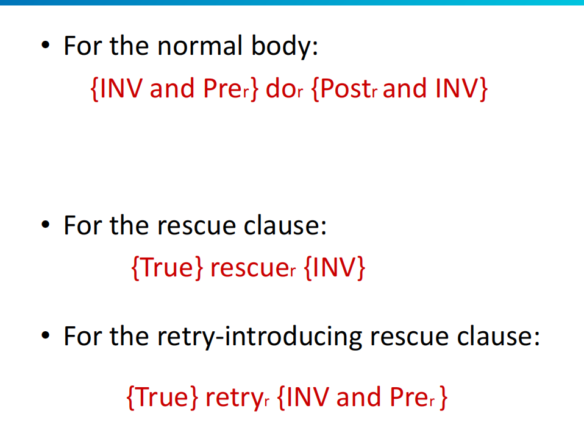
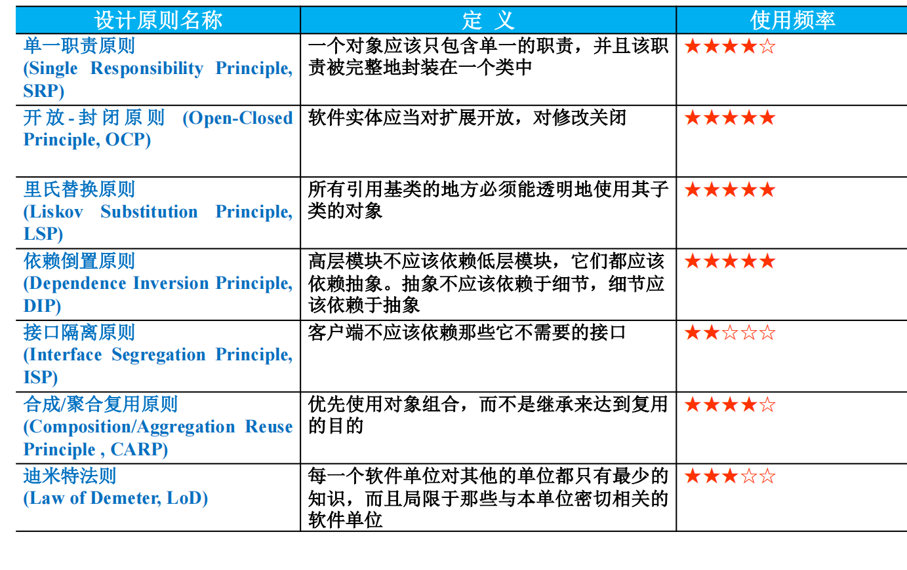
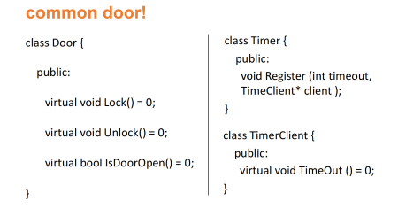
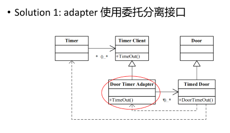
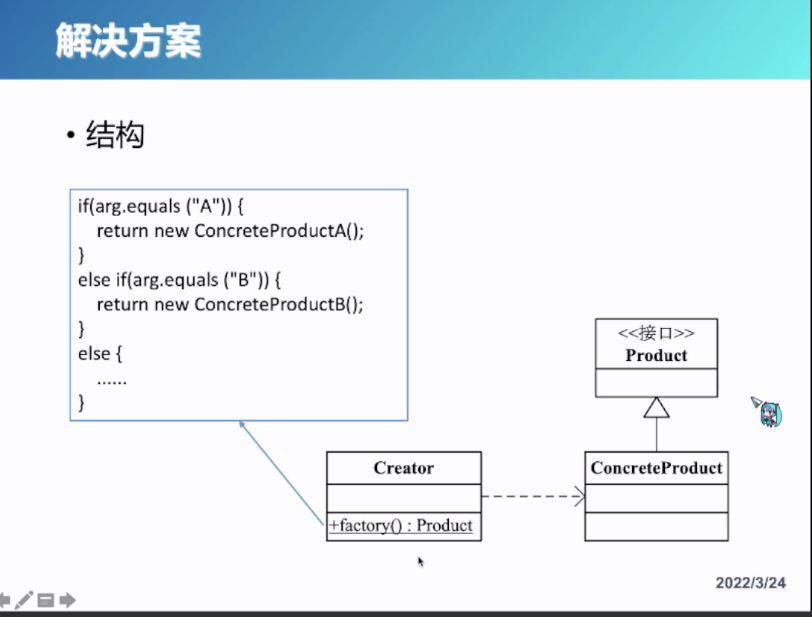
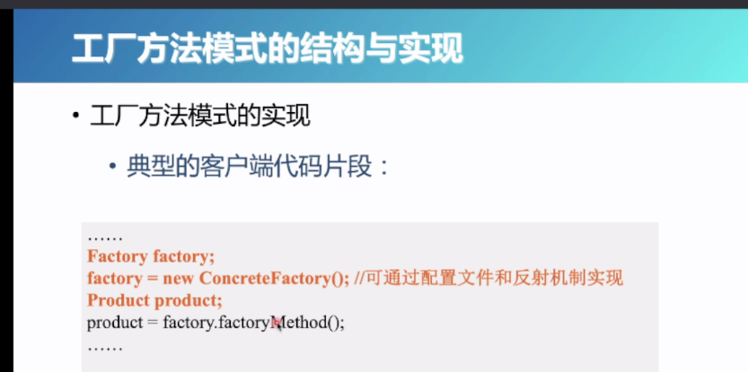
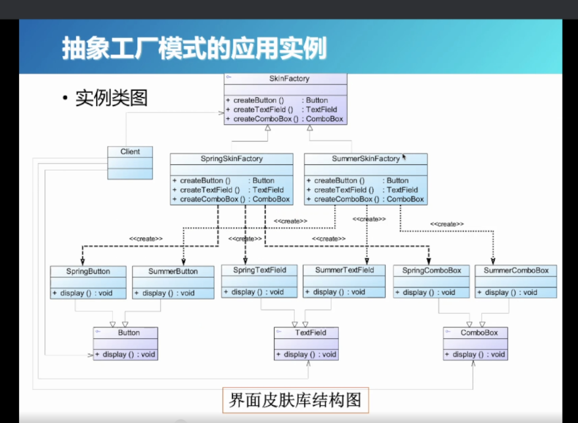
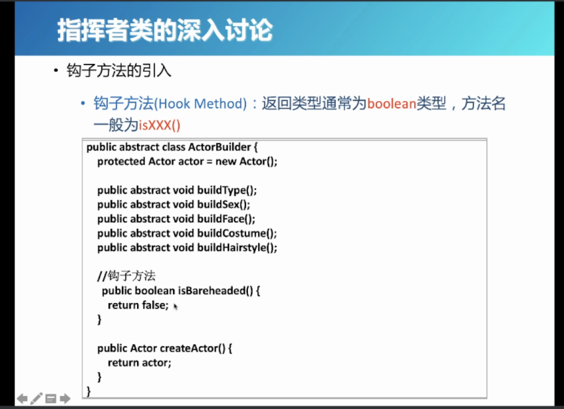
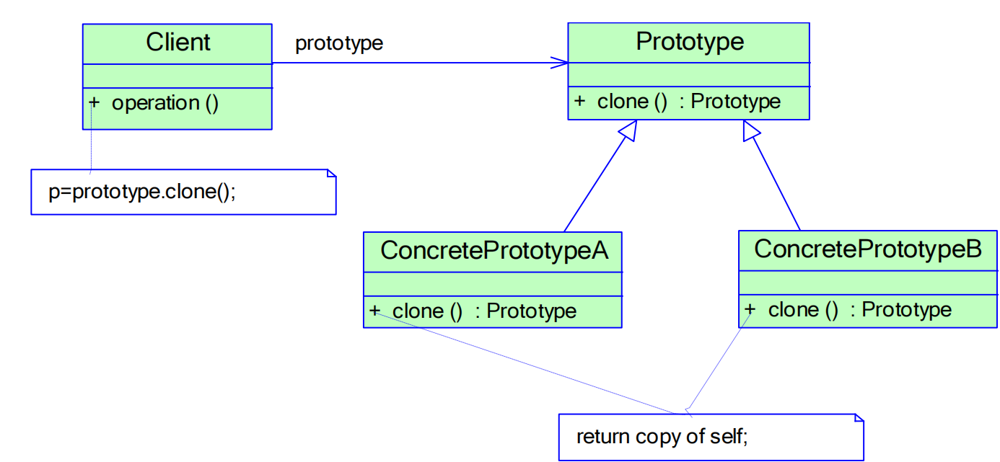
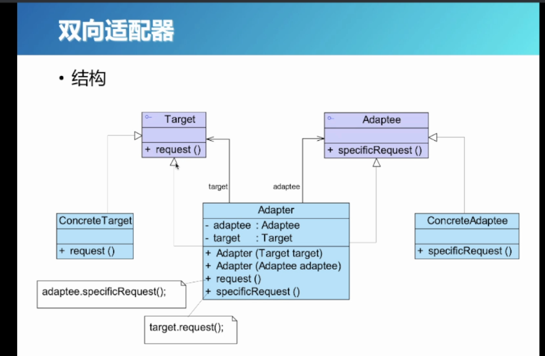

## Intro

- 软件工程：将系统化的、规范的、可度量的方法应用于软件的开发、运行和维护的过程，即将工程化应用与软件中（软件工程复杂性导致的）

- 软件质量？何优何劣？

  - 可从“外部”何“内部”考察
    - 外部：用户直接感觉到的
      - 正确性：依据规约 完成任务
      - 鲁棒性：异常情况
      - 完整性：非法访问和修改
      - 易扩展性：软件因规约改变而改变（需求改变，可以很容易的修改至满足需求）
      - 易复用性：软件模块，可以复用到另外的软件中
      - 兼容性：不同软件模块组合的难易程度
      - 高效性：尽量少使用硬件资源、处理时间、内外存、带宽
      - $\cdots$
    - 内部：用户不能直接发觉的（源码、设计报告、分析报告等）

- 应对复杂性的途径：

  - “元方法”

    - 分解（Decomposition）：分而治之
    - 抽象（Abstraction）：将需求（对象）抽象成类
    - 层次化（Hierarchy）

  - “结构化”开发方法

    - 自顶向下的功能设计、逐步求精、过程抽象、模块化技术

    - 瀑布型模型：软件生命周期模型
      - 需求分析（可行性）$\to$specification$\to$总体设计（伪代码）$\to$细节设计$\to$实现$\to$验证确认$\to$发布
      - 问题
        - 实际代码晚
        - 需求变化的支持？
        - 无软件维护阶段
    - 敏捷编程开发模型：面向对象程序开发常用的模型

#### 软件模块化

- 重要性质

  - 易分解性（Decomposability）

    复杂问题分解成子问题

  - 易组合性（Composability）

    软件单元自由组合成新的软件

  - 易理解性（Understandable）

    不牵涉太广；自描述（一个软件模块的含义只需依赖自己？）

  - 连续性（Continuity）

    规约中的小变化也只会引起结构的小变化

    Design method: Specification $\to$ Architecture

  - 模块保护（Protection）

    异常不扩散/扩散范围有限（异常处理）

- Five Rules（降低耦合度）

  - 直接映射

    模型（问题）和代码（软件）直接映射

  - 少接口

    模块之间尽量少通信

  - 小接口

    模块的接口要小

  - 显示接口

    显示指出：A向B传递？or B向A传递？

    反例：全局变量（不知道A和B之间的接口关系）

  - 信息隐藏

    public、private啥

- 模块

  - 根本特征：“相对独立，功能单一”
  - 低耦合，高内聚

​	**复用**

- 传统技术复用支持

  - 过程（Routine）

  - 包（Package）

    都是啥？

- 面向对象开发方法

  vs 结构化方法

- 结构化思想（基于功能的分解）：
  - 有局限性（如对于不同数据类型）

#### 数据抽象

- 要素：操作（函数），客体（对象）

- 发展
  - 一：无类型的二进制数据 到 基本数据类型
  - 二：基本类型到用户自定义类型（Pascal）
  - 三：到抽象数据类型——面向对象

## 契约式设计

一个软件模块，有precondition（权力），和postcondition（义务）

- precondition：该软件模块正确执行需要满足的条件
- postcondition：执行完该软件模块后应该满足的条件
- invariant：对整个类，它规定了该类任何实例调用任何方法都**必须满足的条件**
- 无需条件判断了~
  - creator program：cp {post & inv}
  - routine：{pre & inv} r {post & inv}

- 契约写入document（接口）
- 与assert对比：
  - 用户可显式看到
  - pre，post，inv
  - document
  - 继承
  - 。。。
- 防御式编程：
  - 需要自己进行验证输入是否符合条件，并给出报错

## 异常处理

（当契约失效时）

- 程序中throw但未处理的异常，需要显式声明出来！
  - 但对于那些常见的 uncheckedError？（如空指针引用，数组越界啥的）不需要显式声明出来
  - 对于可能的checkedError，Java程序必须：要么通过throw声明抛出，要么通过try-catch处理，否则不能通过编译！
- Throwable：
  - Error（system error）
  - Exception
    - RuntimeException（unchecked error：如除零，数组越界，空指针解引用）
      - unchecked error应在测试环节都解决掉
    - 。。。（checked error：与外界交互时的错误，如类型错误，文件找不到。。。）

- 异常处理 和 DbC（当情况不对时处理 vs 定义何时能正确运行；二者互补）
  - Unchecked：当契约失效时发生的异常
  - Checked：不时会发生的，必须要考虑进的情况（不算违背契约）
  - 因此，使用DbC设计代码，代码会分为两部分：
    1. 与外界交互的部分，没有precondition！需要考虑各种情况，有各种exception handling！
    2. 与外界隔离的代码部分，有强precondition！依赖1部分检查得到正确的交互输入从而往下执行！**不会抛出异常！**

- 异常转换
  - 在面向对象程序设计中，对象类可能会调用各种 对象无关的 库函数，库函数可能抛出**应用无关的异常**，对此，对象类需要catch相应的**应用无关异常**，并**抛出**对应的**应用相关异常**（如果没有解决掉异常，需要再抛出异常！）

### Eiffel Exception

- 基本概念
  - success：程序终止在符合契约的状态；反之则失败
  - exception：会导致程序失败的runtime-event（如果没有recover，就会导致调用失败）
    - 一个过程（程序）的失败，会导致它的调用者exception

- 合理的处理异常：仅2种方式
  - Failure：结束调用，并汇报failure，返回给调用者Exception
  - Retrying：再次尝试调用

- 异常机制

  - 一个过程（routine）可以包含rescue clause；rescue clause中可能包含retry
  - 没有执行retry（或执行失败）的rescue clause，会导致routine failure；
  - 如果一个routine内发生异常但没有相应的rescue clause，就会导致该routine fail，并返回调用者exception

- DbC：

  - 

  - 注意，retry语句，指返回到正常开始执行前！
  - 缺少rescue clause的routine，相当于有一个默认的rescue clause：$default\_clause$，负责恢复INV！

## 设计原则

- 面向对象设计原则

  - 可维护性：软件能被理解、改正、适应、扩展的难易程度
  - 可复用性：重复利用
  - 包括一堆原则

  1. 单一职责：一个类，应仅有一个引起它变化的原因

     - 会把不同的职责，分离到多个不同的类，并通过对象组合的方式，来将它们封装在一起

  2. 开放闭合原则：（$\star$最重要）软件实体应该在尽量不修改原有代码的情况下进行扩展

     - 不改源码，改行为（抽象出父类，增加子类）
     - 策略模式：当一个类中要用到其他类对象时，可以通过一个**接口**（其他类来实现该接口）来引用/创建该类实例，这样，当功能发生扩展，要用到的类发生改变时，不需要修改源码（通过读取配置文件方法）
     - 模板方法模式：父类中定义模板类，并且确定好执行顺序，子类实现/重写模板类（just like my 高程project）

  3. 里氏替换：1.所有子类对象 必须是合法的父类对象；2.父类指针调用的任何成员函数，不需要知道它到底指向的是父类成员函数 还是子类成员函数，就可以正常使用！

  4. DIP依赖倒置：要针对接口编程，不是针对具体实现！具体实现细节 依赖于抽象

     - 尽量使用**接口**和**抽象类**进行变量类型声明、参数类型声明、方法返回类型声明、数据类型转换；使用抽象层 编程，具体类写在配置文件中
     - 不该依赖于具体类（任何类都不应从具体类派生）；不过稳定具体类可以派生（如String）；不该覆盖父类中以实现的方法！

  5. 接口隔离原则：客户端不依赖于它不需要的接口；接口太大时，拆分成多个小接口，客户端只需要知道它相关的接口（只提供定制服务，不提供大接口）

     - 如，一个抽象类中定义了一堆抽象接口，则具体子类必须实现全部的接口，即使客户端只需要其中一小部分。**解决方法**：拆分成多个抽象父类。。。
     - 例子：
     - 要实现一个计时的门：（引入了适配器）

     - 或者使用多继承方法：TimedDoor同时继承Timer Client 和Door类

  6. 合成/聚合复用：优先对象组合，而非继承来复用

     - 聚合：拥有关系，整体与部分（指针或引用）；合成：直接包含了其他类对象
     - 合成/聚合复用是 **黑箱复用**（运行时确定具体复用什么类），HAS-A；继承则是 静态复用，破坏封装性，违背设计原则。。IS-A
     - 根据Coad原则判断是否要用继承复用

  7. LoD迪米特法则：（模块之间的信息隐藏）每个软件单位对其他关系紧密的单位仅有最小的知识

     - 类之间 弱耦合
     - 如，类的属性 都不应设为public，而应设为private并提供接口来改变

## 设计模式

- 模式的定义：模式描述了 环境中不断出现的问题+解决问题的核心 => 重用已有的解决方案
  - 软件模式：在一定条件下的软件开发问题及其解法；包括：问题描述、前提条件、解法、效果
    - 软件模式大三律：必须经过3个以上不同类型的系统的检验，一个解决方案才能成为模式
  - 设计模式定义：在特定环境下，为解决某一通用软件设计问题 提供的一套定制的解决方案
    - 包括：**模式名称、问题、解决方案、效果**
    - 分类：创建型、结构型、行为型模式
    - 目的：创建型（创建对象）、结构型（处理类或对象的组合）、行为型（描述类或对象如何交互和怎样分配职责）
  
- 基础知识：
  
  - Java的反射机制：在**程序运行时**获取**已知名称的类或已有对象的相关信息**的一种机制，包括类的方法、属性、父类等信息，还包括实例的创建和实例类型的判断等
    - 具体来说就是：Class类实例可以通过newInstance方法+传入的类名字符串，创建一个该类的新实例（需要强制类型转换）
  - 配置文件：纯文本文件（如XML，properties文件）
  
- 创建型模式：

  - 简单工厂模式（/静态工厂方法）：

    - creator中的factory方法是**静态方法**，接收参数，根据参数类型，返回不同具体子类（这些具体子类具有共同的抽象父类）；
    - 客户端方法（调用静态工厂方法）中，配合配置文件，即可不改代码实现创建对象
    - 将对象的创建和使用分离：类A和B之间关系，不能同时有A创建B和A使用B（单一职责原则）

    - 简单工厂模式的简化：可以把工厂类 和 抽象父类合并（多提供一个静态工厂方法）

    - 模式缺点：1.不符合开闭原则（新增具体子类，需要修改静态工厂方法）；2.增加了类，增高复杂度

  - 工厂方法模式（虚拟构造器/工厂模式）：将实例化具体类对象过程 延迟到了工厂类的子类（具体工厂）！（这样就符合了开闭）

    - 

    - 不再是静态方法！！是通过在客户端程序中 用配置文件+反射机制 来实现的！

    - 工厂方法的重载：抽象父类中，可以定义多个重载的 创建具体子类对象 方法

  - 抽象工厂模式（Kit）：目的是 创建一系列相关的产品（一族产品）；工厂方法则是一次只产生一种产品

    - 例子：

    - 和工厂模式差不多，就是有多个不同的（非重载的）生产方法
    - 增加新的产品族：很方便，符合开闭原则；但若增加新的产品等级结构（新生产方法），则需要改源码！
    - 每个具体的工厂，一般只有一个（单例）

  - 建造者模式：创建复杂的对象（由多个部件 按顺序 组合而成），将一个复杂的对象的 构建过程 和它的表示 相分离（可以复用）

    - 抽象Builder父类：有一个protected的product成员，以及若干构建组件的 抽象方法；
    - 具体Builder子类：实现各个构建组件的方法，直接作用在product上
    - Director类：有一个Builder指针，指向想要创建的对象类型对应的具体Builder；construct方法会**按照一定顺序**调用Builder的各组件构建方法（按什么顺序，通过修改Director类的construct代码）

    - 拓展：Director和抽象Builder合并：抽象Builder中提供一个静态接口Construct（接收一个具体Builder引用）；或者作为非静态接口，具体Builder实例直接调用Construct接口

    - 钩子方法：

      然后在Construct中判断，在具体Builder中重写钩子方法。可是为什么不直接在具体Builder中，把不需要的接口实现为空呢？

  - 原型模式：通过复制一个原型对象，得到多个与原型模式相同的对象；创建新对象的工厂，就是原型类本身；当然，每个复制对象都是独立的

    - 浅克隆与深克隆：浅：值复制（引用/指针类型成员变量 只是地址克隆）；深：引用/指针类型成员变量也复制了一份

    - 

      （client中已有了具体对象，想要克隆只需执行对应的clone方法）

    - 自己手动new一个新对象，并完成赋值，可实现浅、深克隆

    - Java中实现浅克隆：可通过 具体原型类 （**同时？**）继承Java的cloneable接口（和抽象原型？），在clone方法中调用super.clone（）即可实现浅克隆

    - Java中实现深克隆：具体原型类、其中的成员对象类，都实现Serializable接口，然后具体调用方法比较复杂。。。

    - 拓展（原型管理器）：可以维护一个hash table，键值——原型对象；可以通过传入键值，获得对应原型对象的克隆

    - 缺点：违背开闭原则（一个类如果改造，需要同时改clone（比如深克隆））
  
  - 单例模式：
    - 确保一个类只有一个实例，并提供了一个全局访问点（用户可访问）
    - 必须自行创建该实例
    - 类：static 类引用/指针：instance，指向自身；+一些机制确保仅一个实例；+一个public的接口getInstance，返回instance
      - 要点：1.私有构造函数？确保只有一个实例！
      - 2.静态私有实例定义？只能通过提供的接口访问到
      - 3.静态公有工厂方法，返回唯一实例
    - 应用场景1：处理并发问题，避免不一致性！
    - 实现方式：
      - 懒汉式单例（在访问时创建单例，不访问就不创建）：多线程同时访问，可能会创建多个实例！
        - 因此要加上锁；简单上锁，对效率影响太大，因此要双重判断（先看单例是否存在，不存在则上锁，再次判断是否存在！）
      - 饿汉式，直接创建
      - Java中最好的方式：静态内部类：在单例类中定义一个静态私有类HolderClass，其有一个静态私有的单例类实例，（同时结合了懒汉和饿汉的有点）原理不知道！
      - 拓展：允许可变数目的实例（多例类）
        - Monostate：也保证获取对象单一性，且可创建多个实例，但表现同一个对象一样
          - 即使全部销毁，也不会造成信息丢失！
          - 就是把对象的所有变量设成静态的

- 结构型模式（Structural Pattern）：将现有类/对象组织在一起

  - 适配器模式（Adapter Pattern）：将不兼容的类结构（接口）转换为用户需要的类结构（接口），不兼容类在一起工作

    - 需要转换的类Adaptee：（类适配器）定义Adapter，继承该类，同时实现 给用户端的抽象接口，调用Adaptee的方法；这样一来，既是一个Adaptee类，又与原类结构/接口兼容！
    - （对象适配器）：用户端接口 是一个类（不是抽象接口），则Adapter继承用户类，并引用Adaptee（因为Java不支持多继承）

    - 拓展：缺省适配器模式：可能不需要实现抽象接口的所有方法
      - 在抽象接口 和 具体适配器之间，增加一个抽象类 实现了所有方法（缺省实现，一般就是空方法）；具体适配器继承抽象缺省类，只需要重新实现需要的方法即可
    - 拓展：双向适配器：同时实现了两边的 客户端接口
      - 

  - 桥接模式：（毛笔和蜡笔，颜色和型号是否耦合，决定了拓展的难易）
    - 将抽象部分 与它的实现部分解耦，使二者都可独立变化；将类之间静态继承关系，转为类之间的动态组合的关系
    - 四部分：1.Abstraction抽象类，2.扩充抽象类（实现1），3.Implementor实现类接口，4.具体实现类（实现3）
      1. 抽象类：有实现类接口的引用，并对外提供接口方法
      2. 扩充抽象类：具体实现接口方法（会调用Implementor的方法）
      3. 实现类接口：抽象出具体实现中可能变化的维度
      4. 具体实现类：
    - 拓展：可以和适配器联用（具体实现类作为Adapter来复用一些已有的实现，来适配 实现类接口）
    - 拓展：两个以上变化维度，怎么用桥接模式？

  - 组合模式（Composite）：处理树形结构，如文件系统

    - 两类元素：容器（文件夹），叶子（文件）；如何一致的（对用户透明的）处理不同元素？

    - 定义抽象父类：抽象方法包括容器管理方法、叶子操作方法；容器、叶子均继承抽象父类；
    - 容器类：有一个ArrayList，包括所有包含的子类（容器/叶子）；操作方法，递归调用所有子类的操作方法
    - 叶子类：实现操作方法；调用容器管理方法，需要报错

    1. 以上 为透明组合模式（但不安全！）
    2. 安全组合模式：抽象构建 并不声明 管理成员方法，而在容器类中声明；但对客户端并不透明了！

  - 装饰模式：不改变对象本身功能基础上，增加额外的新行为；**不通过**继承技术，而是通过对象关联关系，来动态增加功能

    - 将要添加的额外行为，与原有功能 解耦，以实现不同原有功能 和额外行为的组合

    1. 抽象Component
    2. 具体Component：实现原有功能
    3. 抽象Decorator：也继承抽象Component，且有一个抽象C的引用（也实现了抽象C，一般就直接调引用C的方法）！引用也可以引用一个其他的Decorator，这样就可以把额外行为叠加！
    4. 具体Decorator：继承抽象D，添加一些额外方法，重写抽象D的实现，加上自己的拓展功能

    - 透明vs半透明装饰模式：
      - 透明：所有构建、装饰类，都得通过抽象构建（Component）来声明；但这样用户无法单独调用具体装饰类 的新增方法
      - 半透明：构建通过抽象C声明，装饰类必须指定**具体装饰类**；但 不能对同一对象多次装饰！

  - 外观模式（门面模式）：一个客户类需要和多个业务类交互；则在客户类 和 业务类之间，引入一个外观类，客户类只需与外观类交互即可，为多个业务类的调用提供了统一的接口
    - 包括两个角色：
      - 外观类：包含不同子系统引用各一个，提供一个对外（客户）接口 来完成依次与各子系统的交互
      - 子系统类：已有的实现好的类和方法
    - 外观类可以增加一层抽象，以支持子系统类变化；
    - 也可以和单例模式联用
  
  - 享元模式（Flyweight pattern 轻量级模式）：（运行时可能会创建多个类似/相同的对象，想想unity里的prefab）通过享元模式 来避免重复工作；
  
    - 直观理解：显示英文单词，只需记录26个字母的显示，+每个单词的排列组合（/颜色/字体等等）即可~
    - 两部分：
      - 内部状态：享元对象内部，不会改变的，只需记录一份
      - 外部状态：随环境改变而改变，与内部状态相独立
    - 
      - ConcreteFlyweight就是各个具体享元子类，比如各字母的显示？
      - UnsharedConcreteFlyweight：就是一些确定的特例？allState包括了内部和外部状态，全部固定；也可以接收外部状态
        - 单纯享元模式：无Unshared
      - operation方法，intri+extri状态 得到一个完整的对象
      - Factory就是 通过key，返回享元对象；一般使用：单例+简单工厂模式；
  
    - 复合享元模式：和组合模式结合？CompositeConcreteFlyweight：包含了若干个单纯享元对象，想为它们设置相同的外部状态？
  
  - 代理模式：1.只有在要使用的时候，才需要将对象本身加载到内存中（可能很大，如图像/视频），而其他时候，只需要提供一个**代理**（通过这个代理/占位符 来访问目标对象）；2.访问/使用远程主机对象功能，屏蔽掉访问的细节
  
    - 
    - 注意：realSubject是直接引用具体对象（而非通过抽象父类？）；与decorator对比，decorator则是有一个抽象父类引用
  
    - 几种代理模式：1.远程代理；2.虚拟代理（原对象大，用的时候才加载）；3.保护代理（主要通过pre/postRequest）；4.缓冲代理（用来多用户共享结果）；5.智能引用代理（pre/postRequest）
  
    - Java的动态代理：运行时刻，根据实际需要 动态创建代理类（不重要哦~）

- 行为型模式：系统在运行时，对象与对象之间的通信与协作；不仅关注类和对象本身，还关注它们之间的相互作用和职责划分

**类行为型模式**：使用继承关系，主要通过多态方式分配父类子类职责；

**对象行为型模式**：使用对象的关联关系来分配行为

- - 职责链模式：避免将 请求发送者 与 接收者耦合在一起 => 接收者连接成一条链，沿着链传递请求（可直线/树形/环形），直到一个对象能处理它为止：**对象行为型模式**

    - ConcreteHandler中的handleRequest方法：如果条件满足 则处理请求，否则调用successor的handleRequest方法
    - 纯/不纯的职责链模式：
      - 纯：处理者要么完全承担，要么完全不处理，交给下家；一个请求必须被某一处理者处理接收；
      - 不纯：与上相反；且可以最终不被任何处理者对象接受

  - 命令模式：三种不同对象：开关（请求发送者）；电器（请求处理者）；电线（连接不同发送者与处理者）。前两者不直接耦合 **对象行为型模式**

    - 具体的：在 发送者 和 处理者/接收者 之间引入新的 **命令对象**（将请求 封装为一个对象）
      - 一个请求 对应一个命令，将发出命令 与 执行命令 完全解耦；

    - 四种角色：Command，ConcreteCommand，Invoker（调用者），Receiver（接收者）

    - Invoker中的不同具体命令**对象** 对应了不同的功能（以及接收者）

    - 扩展1：CommandQueue类，（一个请求 有多个接收者相应=>对应多个具体命令对象）
      - 批处理：依次调用 CommandQueue中具体命令对象的execute
    - 扩展2：记录请求日志
      - 将命令对象 序列化（就是哈希？）， 写入日志文件
    - 扩展3：支持可撤销操作
      - 根据 请求日志

    - 扩展4：+组合模式，实现宏命令
      - 就是之前的CommandQueue的拓展版本？

  - 迭代器模式：1.提供一种顺序访问聚合对象中各个元素的方法，且不暴露对象的内部表示；2.单一职责原则：聚合类只需要解决 存储对象的职责，而无需关心遍历！ **对象行为型模式**

    - 聚合类+迭代器类
    - 

    - 聚集类的宽接口 vs 窄接口：聚集类是否**对外**（客户）提供了可以修改聚集元素的方法
      - 宽接口=>白箱聚集：具体迭代子可以仅仅只是维护一个游标，从外部访问（即使用客户端层面的接口），相当于只是做了一层封装，门面模式？；意义就是 客户端代码 与访问/迭代 解耦=>外禀/游标迭代子
      - （对客户端）窄接口=>黑箱聚集：这时一般采用 让 具体迭代类 是 具体聚集类 的内部类，可以自由访问聚集元素=>内禀迭代子

  - 中介者模式：避免/减少 对象与对象之间的 多对多关系，过度耦合 => 引入中介者，所有对象都只和中介者 来与其他对象作用（有点像门面模式？那它们的区别在哪呢？**结构型 和 行为型模式** 的区别）

    - 

    - Mediator中介者的职责：1.中转作用（结构型）：具体同事 引用其他同事时，通过中介者来**间接引用**（这就是结构型的含义？）；2.协调作用（行为型）：同事可以一致的与中介者交互？中介者根据自己内部逻辑来处理？

  - 备忘录模式：撤回操作（命令模式也可）**对象行为模式**

    - 在不破坏对象封装的前提下，捕获一个对象的内部状态，并保存在对象外；
    - 

    - Originator源发器：需要保存状态的类，想要保存时，会创建一个memento；Memento：备忘录类？；Caretaker：可以维护一个Memento的list，实现多步撤回
    - 有可能memento作为originator的内部成员类（因为每个memento和originator一一对应）

  - **观察者**模式（很多别名之一：model/view模式 MVC）：**对象行为型模式**

    - 观察目标Observer+观察者Subject（一对多的依赖关系），观察目标对象的变化 可以连带改变 （通知）多个观察者对象
    - （其中subject引用线并不典型/关键）
    - Java事件处理机制：也是用观察者模式：事件源（如按钮/鼠标点击）充当观察目标角色；事件监听器为 抽象观察者；事件处理对象 为具体观察者
    - MVC（Model-View-Controller）架构：模型（观察目标），视图（观察者），控制器（两者之间的中介者）
      - 模型发生变化：通过controller，通知视图 update
      - 

    - （只要具体observer不直接引用具体subject，或者新的subject不需要被引用：则）符合开闭原则~
    - 不知道具体发生了什么变化，也不知道具体哪些对象因此发生了改变：才适用！

  - 状态模式：某个类的某些对象可能具有多种**状态**；状态间（在某情况下）可相互转换；对象的不同状态具有**不同行为**。**对象行为型模式**

    1. 传统方法：如果只用if-else来实现（一个大函数，里面判断当前状态，然后执行对应操作）=> 可扩展性差，需要修改class的源代码，以及可能需要修改客户端代码

    - OO方法：将一个对象的状态 从该对象中分离了出来，封装到专门的 **状态类**；客户端 无需关心对象的状态，可以一致的使用
    - 

    - 状态之间的转换？：1.可以放在Context类中，由环境类负责状态的转换：但违背了开闭？2.状态转换 直接封装在了具体状态类中，提供一个changeState接口，则需要在状态类中 维护一个Context类的引用，获得value，以及setState：也违背了开闭？

  - 策略/政策模式：定义独立的类 来封装不同具体算法（STL：algorithm？）-> 策略类。**对象行为型模式**

    - 有点像状态模式？

    - 完美支持开闭原则；算法的复用！

  - 模板方法模式：基于继承，抽象父类中定义操作的算法框架（模板方法），一些步骤的具体实现 延迟到具体子类中 => **类行为型模式**

    - 

    - 具体子类 只覆盖基本方法，但不改变算法中步骤的执行次序！
    - 基本方法（抽象父类 模板方法中用到的方法）：抽象方法、具体方法、钩子方法
      - 钩子方法：在模板方法中，通过钩子方法 来判断某一步骤是否执行！
    - **反向控制结构**：子类覆盖父类的钩子方法，来决定某一步骤是否需要执行！
    - 符合开闭原则（增加具体子类），单一职责原则
    - 如何结合桥接模式？（避免因：父类中可变方法多，子类个数增加）

  - 访问者模式visitor：对象结构中 存储了多种不同类型的对象信息；同一对象结构中元素的操作方式不唯一，提供多种操作方式，并且可能要增加：**对象行为型模式**

    - 

    - 动态双重分派机制：objectStructure中 会调用Element.accept(visitor)：其中又调用了visitor.visit(elem) => 先根据element的类型，动态决定调用哪个accept方法；然后根据visitor类型（和element类型？=>element类型 静态决定了调用哪个接口（通过重载）），动态决定调用哪个visit
    - 增加新的访问者：则无需修改源码，符合开闭；新具体元素，则违背开闭。元素的不同行为 分别集中在不同访问者中，职责清晰；但破坏了封装性
